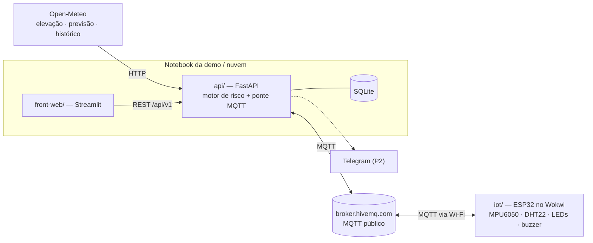

# Arquitetura

## Visão geral



| Componente | Pasta | Responsabilidade | Não faz |
|---|---|---|---|
| **API** | `api/` | Busca dados externos, calcula relevo, risco e limite dinâmico, fala MQTT com o equipamento, guarda telemetria e eventos e expõe tudo em REST | Interface |
| **Front-web** | `front-web/` | Mapas, gráficos, painéis, formulários | Nenhuma regra de negócio. Não fala MQTT nem acessa a Open-Meteo |
| **Dispositivo** | `iot/` | Mede a inclinação e o ambiente, aplica localmente o limite recebido, alerta o operador, detecta capotamento | Não calcula risco climático. Só aplica o limite que a API manda |
| **Broker MQTT** | externo | Entrega mensagens entre a API e o ESP32 | Nada é guardado nele além das mensagens retained |
| **Open-Meteo** | externo | Elevação (DEM de 90 m), previsão, histórico | — |

**Por que MQTT e não HTTP entre o ESP32 e a API?** O ESP32 roda na nuvem do Wokwi e não enxerga o
`localhost` do notebook. Com MQTT, os dois lados só fazem conexões **de saída** para o broker
público, e isso funciona em qualquer rede. Ver [decisoes.md](decisoes.md) (ADR-003 e ADR-008).

## Fluxos principais

### 1. Mapa de risco (W1 → W2 → W3)

1. O front pede `GET /api/v1/farms/{id}/risk?days=7`.
2. A API monta uma grade 10×10 sobre a fazenda e busca a elevação (1 chamada, até 100 pontos) → calcula a inclinação e as classes de terreno (W2). Cache de 24 h.
3. A API busca a previsão horária do centro da fazenda (`past_days=3`, `forecast_days=7`) e agrega por dia (I1). Cache de 1 h.
4. O motor de risco cruza relevo × clima célula a célula e dia a dia (W3/W7) e devolve os níveis e os motivos.
5. O front desenha o mapa e a linha do tempo.

### 2. Limite dinâmico (W4 → E3 → E2)

1. A API calcula o limite de inclinação do dia a partir do estado do solo da fazenda do equipamento.
2. Publica em `.../devices/{id}/config` com **retained**. Assim o ESP32 recebe o último limite assim que conecta.
3. O ESP32 guarda o limite (NVS) e passa a comparar a inclinação medida com ele, acendendo o LED e o buzzer localmente.

### 3. Telemetria e eventos (E4/E5 → I2 → I3 → W5)

1. O ESP32 publica a telemetria a cada 5 s e os eventos (`tilt_alert`, `rollover`, `incident_report`) na hora em que acontecem.
2. A ponte MQTT da API (I2) valida o payload, grava no SQLite (I3) e, se for um evento crítico, dispara o Telegram (W10).
3. O painel ao vivo (W5) consulta a API a cada 2 s.

## Endpoints da API (v1)

Planejados. Ao implementar um endpoint, marque ✅ aqui e no `api/README.md`.

| Método | Rota | Feature | Status |
|---|---|---|---|
| GET | `/api/v1/health` | base | ✅ |
| GET | `/api/v1/farms` | W1 | ⬜ |
| GET | `/api/v1/farms/{farm_id}` | W1 | ⬜ |
| GET | `/api/v1/farms/{farm_id}/terrain` | W2 | ⬜ |
| GET | `/api/v1/farms/{farm_id}/risk?days=7&scenario=` | W3, W7 | ⬜ |
| GET | `/api/v1/farms/{farm_id}/recommendations` | W6 | ⬜ |
| GET | `/api/v1/farms/{farm_id}/underwriting` | W8 | ⬜ |
| GET | `/api/v1/devices/{device_id}/limit` | W4 | ⬜ |
| POST | `/api/v1/devices/{device_id}/limit/publish` | W4 | ⬜ |
| GET | `/api/v1/devices/{device_id}/status` | W5 | ⬜ |
| GET | `/api/v1/devices/{device_id}/telemetry/latest` | W5 | ⬜ |
| GET | `/api/v1/devices/{device_id}/telemetry?minutes=10` | W5 | ⬜ |
| GET | `/api/v1/devices/{device_id}/events` | W5, E5, E8 | ⬜ |
| GET | `/api/v1/devices/{device_id}/history` | W11 | ⬜ |
| GET | `/api/v1/replay/cases` | W9 | ⬜ |
| POST | `/api/v1/replay` | W9 | ⬜ |

## Organização interna da API

```
routes (HTTP)  →  services (regras, funções puras)  →  clients (Open-Meteo, Telegram)
                              ↓
                   repositories/db (SQLite, I3)
```

- **routes**: validam a entrada, chamam os services e devolvem schemas. Não têm lógica.
- **services**: `terrain.py`, `weather.py`, `risk.py`, `limits.py`, `underwriting.py`, `replay.py`.
- **clients**: `open_meteo.py`, `telegram.py`.
- **mqtt/**: ponte MQTT (I2), que roda no `lifespan` do FastAPI.

## Fora do escopo (vai para o roadmap do pitch)

App mobile, BLE, GPS real, modelos de ML (score supervisionado, anomalia, fraude), login e multiusuário,
integrações com INMET, ANA, SRTM e IBGE, e o Passaporte Digital completo.
