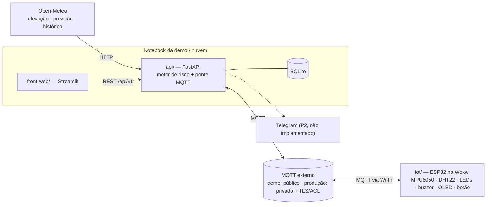
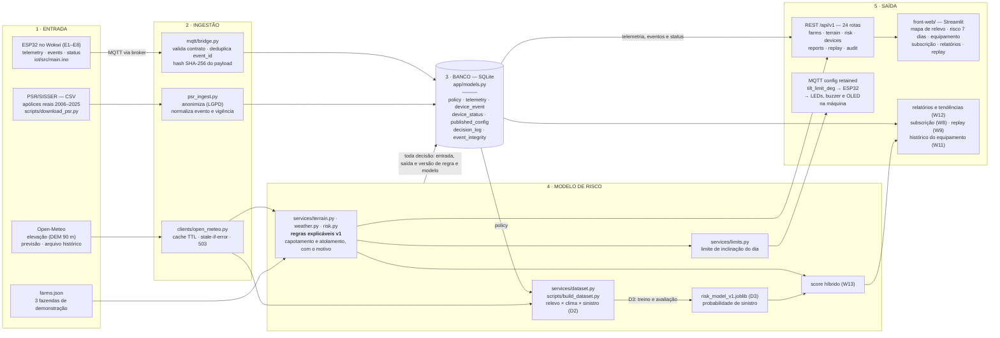

# Arquitetura

## Visão geral



| Componente | Pasta | Responsabilidade | Não faz |
|---|---|---|---|
| **API** | `api/` | Busca dados externos, calcula relevo, risco e limite dinâmico, fala MQTT com o equipamento, guarda telemetria e eventos e expõe tudo em REST | Interface |
| **Front-web** | `front-web/` | Mapas, gráficos, painéis, formulários | Nenhuma regra de negócio. Não fala MQTT nem acessa a Open-Meteo |
| **Dispositivo** | `iot/` | Mede a inclinação e o ambiente, aplica localmente o limite recebido, alerta o operador, detecta capotamento | Não calcula risco climático. Só aplica o limite que a API manda |
| **Broker MQTT** | externo | Na demo, broker público com dados sintéticos; em produção, broker privado com TLS, autenticação e ACL por dispositivo | O broker público não autentica origem nem protege confidencialidade; nunca usar com equipamento ou dados reais |
| **Open-Meteo** | externo | Elevação (DEM de 90 m), previsão, histórico | — |
| **Dados e modelo** | `api/app/services/` + `data/` | Ingestão do PSR (sinistros reais), dataset relevo × clima, treino e métricas. O artefato do modelo é carregado pela API | Não treina em produção |

**Por que MQTT e não HTTP entre o ESP32 e a API?** O ESP32 roda na nuvem do Wokwi e não enxerga o
`localhost` do notebook. Com MQTT, os dois lados só fazem conexões **de saída** para o broker
público, e isso funciona em qualquer rede. Ver [decisoes.md](decisoes.md) (ADR-003 e ADR-008).

## Diagrama final (entrada → banco → modelo → saída)

Este é o **entregável 6 do enunciado**: o caminho completo do dado, do jeito que o sistema está
construído. Conferido contra o código em **21/09/2026** (arquivos, tabelas e rotas existentes).

> **Como ler:** caixa de **contorno contínuo = entregue e com teste**. Caixa **tracejada em
> vermelho = ainda não implementada** — estaria no diagrama para mostrar onde encaixa, com o
> rótulo da feature que falta. Nada aqui é ilustração de intenção: se está sólido, existe no
> repositório.
>
> **Na revisão de 21/09 não sobrou nenhuma caixa tracejada:** tudo que está desenhado foi
> entregue, inclusive o modelo (D3), o score híbrido (W13) e o histórico do equipamento (W11).
> O que **não** foi implementado simplesmente não aparece no diagrama, para não dar a entender
> que faz parte do sistema — é o caso do alerta pelo Telegram (W10) e do **SoilGrids**, que
> chegou a ser cogitado como fonte de solo e nunca foi escrito.



**O que o diagrama diz sobre o estado do projeto**

| Camada | Entregue | Ainda não |
|---|---|---|
| Entrada | PSR completo, elevação, previsão, arquivo histórico, telemetria do ESP32, 3 fazendas | SoilGrids (solo) — cogitado, nunca implementado |
| Ingestão | anonimização e normalização do PSR (D1), cliente com cache e *stale-if-error* (I1), ponte MQTT com deduplicação e hash (I2, I5) | — |
| Banco | as 7 tabelas existem e são escritas (I3, I5, D1) | — |
| Modelo | **regras explicáveis v1** (W2, W3, W4), o gerador de dataset (D2, 2.256 linhas) e o **modelo treinado com métricas publicadas** (D3, retreinado em 21/09), lido pela API e exposto ao lado da regra (W13) | as 244 linhas que faltam para as 2.500 pedidas: o lote foi encerrado quando a **cota diária** da Open-Meteo se esgotou e foi consolidado com o que estava pronto |
| Saída | 24 rotas REST, seis telas do Streamlit, `config` retained no equipamento, alerta local, auditoria, relatórios (W12), subscrição (W8), replay (W9) e histórico do equipamento (W11) | alerta pelo Telegram (W10) — **⛔ decidido fora do escopo** (exige token de bot), não é pendência de prazo |

> **O modelo existe e, desde o retreino de 21/09, supera o baseline por regras — com ressalvas.**
> Ele está no diagrama porque foi treinado, versionado e é carregado pela API — e entra como
> **segunda leitura**, nunca no lugar da regra. No teste de 2024 marca AUC-PR 0,144 contra 0,074
> do baseline (diferença +0,070, IC 95% [+0,003, +0,169]), mas: o teste tem **26 positivos**,
> abaixo do mínimo de 30 que o próprio script de treino exige para conclusão firme; o IC quase
> toca o zero; e a virada veio da **troca do conjunto de teste** (a D2 fechou em 2.256 linhas),
> não de o modelo ter melhorado. Além disso, o baseline nunca discriminou o alvo `target_claim`,
> dominado por **seca e geada** — no alvo que as regras de fato tratam (`target_rain_claim`,
> chuva e tempestade) quem discrimina é o baseline. Números, intervalo de confiança e a leitura
> completa em [dados-e-modelo.md](dados-e-modelo.md#resultados-do-modelo-d3). **O alerta ao
> operador continua vindo das regras explicáveis** ([regras-de-risco.md §11](regras-de-risco.md)).

**O que sustenta cada seta** — os arquivos citados no diagrama são os reais; a lista completa de
rotas está em [Endpoints da API (v1)](#endpoints-da-api-v1), as tabelas em `api/app/models.py`, e a
situação feature a feature em [entregaveis.md](entregaveis.md) e
[user-stories.md](user-stories.md).

## Fluxos principais

### 1. Mapa de risco (W1 → W2 → W3)

1. O front pede `GET /api/v1/farms/{id}/risk?days=7`.
2. A API monta uma grade 10×10 sobre a fazenda e busca a elevação em **1 chamada de 100 pontos** (`MAX_ELEVATION_POINTS = 100` em `clients/open_meteo.py`) → calcula a inclinação e as classes de terreno (W2). Cache de 24 h.
   > ⚠️ **Custo da chamada — resolvido em 21/09.** A hipótese de 20/09 era que a cota fosse por **ritmo**; ela foi **derrubada**. O teto da Open-Meteo é de **peso**: uma requisição que cobre mais de duas semanas conta como **várias** chamadas. Por isso o gerador do dataset (D2), cuja janela é a vigência da apólice, gasta ~21 chamadas por requisição de clima e esgota a cota **diária**, enquanto o mapa de relevo — 100 pontos de elevação numa requisição só, sem janela longa — continua pedindo tudo de uma vez e funcionando na demo. Baixar o ritmo não ajudaria; o que resolve é orçar por peso. A conta está em [dados-e-modelo.md](dados-e-modelo.md#orçamento-de-chamadas-da-open-meteo). Continua valendo o aviso do [demo.md](demo.md): aqueça o cache antes de apresentar, porque a cota é compartilhada com o que já foi gasto no dia.
3. A API busca a previsão horária do centro da fazenda (`past_days=3`, `forecast_days=7`) e agrega por dia (I1). Cache de 1 h.
4. O motor de risco cruza relevo × clima célula a célula e dia a dia (W3/W7) e devolve os níveis e os motivos.
5. O front desenha o mapa e a linha do tempo.

### 2. Limite dinâmico (W4 → E3 → E2)

1. A API calcula o limite de inclinação do dia a partir do estado do solo da fazenda do equipamento.
2. Publica em `.../devices/{id}/config` com **retained**. Assim o ESP32 recebe o último limite assim que conecta.
3. O ESP32 guarda o limite (NVS) e passa a comparar a inclinação medida com ele, acendendo o LED e o buzzer localmente.

### 3. Telemetria e eventos (E4/E5 → I2 → I3 → W5)

1. O ESP32 publica a telemetria a cada 5 s e os eventos (`tilt_alert`, `rollover`, `incident_report`) na hora em que acontecem.
2. A ponte MQTT da API (I2) valida o payload, grava no SQLite (I3) e registra o alerta na trilha de auditoria (I5). O disparo para o Telegram é a **W10, que ainda não foi implementada**.
3. O painel ao vivo (W5) consulta a API a cada 2 s.

## Endpoints da API (v1)

Ao implementar um endpoint, marque ✅ aqui e no `api/README.md`.

> Conferido em 21/09/2026 contra `api/app/api/v1/router.py`. São **24 rotas registradas**,
> contando cada variante `.csv` dos relatórios como uma rota própria (por isso a contagem da
> tabela abaixo, que agrupa `.csv` na mesma linha, dá menos). Não há nenhum item ⬜: todas as
> rotas da tabela estão implementadas.

| Método | Rota | Feature | Status |
|---|---|---|---|
| GET | `/api/v1/health` | base | ✅ |
| GET | `/api/v1/farms` | W1 | ✅ |
| GET | `/api/v1/farms/{farm_id}` | W1 | ✅ |
| GET | `/api/v1/farms/{farm_id}/terrain` | W2 | ✅ |
| GET | `/api/v1/farms/{farm_id}/risk?days=7&scenario=` | W3, W7 | ✅ (5 perigos) |
| GET | `/api/v1/farms/{farm_id}/recommendations?days=2&scenario=` | W6 | ✅ |
| GET | `/api/v1/farms/{farm_id}/underwriting` | W8 | ✅ |
| GET | `/api/v1/devices/{device_id}/limit?date=&scenario=` | W4 | ✅ |
| POST | `/api/v1/devices/{device_id}/limit/publish` | W4 | ✅ |
| GET | `/api/v1/devices/{device_id}/status` | W5 | ✅ |
| GET | `/api/v1/devices/{device_id}/telemetry/latest` | W5 | ✅ |
| GET | `/api/v1/devices/{device_id}/telemetry?minutes=10` | W5 | ✅ |
| GET | `/api/v1/devices/{device_id}/events?limit=20` | W5, E5, E8 | ✅ |
| GET | `/api/v1/devices/{device_id}/history?days=7` | W11 | ✅ |
| GET | `/api/v1/replay/cases` | W9 | ✅ |
| GET | `/api/v1/replay/summary` | W9 | ✅ |
| POST | `/api/v1/replay` | W9 | ✅ |
| GET | `/api/v1/reports/equipment/{device_id}?days=7` (+ `.csv`) | W12 | ✅ |
| GET | `/api/v1/reports/region?state=&from_year=&to_year=` (+ `.csv`) | W12 | ✅ |
| GET | `/api/v1/reports/crop?from_year=&to_year=&state=` (+ `.csv`) | W12 | ✅ |
| GET | `/api/v1/audit?entity=&decision_type=&limit=` | I5 (exige `X-API-Key`) | ✅ |

## Organização interna da API

```
routes (HTTP)  →  services (regras, funções puras)  →  clients (Open-Meteo)
                              ↓
                   repositories → db (SQLite, I3)
```

Conferido em 21/09/2026, arquivo por arquivo. Em *itálico*, o que a feature prevê mas **ainda não
existe**.

- **routes** (`app/api/v1/routes/`): `health.py`, `farms.py`, `devices.py`, `reports.py`,
  `replay.py`, `audit.py`. Validam a entrada, chamam os services e devolvem schemas. Não têm
  lógica.
- **services** (`app/services/`): `farms.py`, `terrain.py`, `weather.py`, `risk.py`, `limits.py`,
  `devices.py`, `scenarios.py`, `dataset.py`, `psr_ingest.py`, `recommendations.py` (W6),
  `underwriting.py` (W8), `replay.py` (W9), `reports.py` (W12), `model.py` (D3) e
  `model_scoring.py` (W13, a ponte entre o motor de regras e o modelo).
- **clients** (`app/clients/`): `open_meteo.py` · *`telegram.py` (W10)*.
- **repositories** (`app/repositories/`): `devices.py`, `audit.py`.
- **core** (`app/core/`): `config.py`, `cache.py`, `clock.py`, `logging.py`, `security.py`,
  `versions.py`.
- **data/** (`app/data/`): `farms.json` (W1), `replay_cases.json` (W9) e `model/` com o artefato
  do modelo e o JSON de métricas (D3), versionados no Git.
- **mqtt/** (`app/mqtt/`): ponte MQTT (I2) — `bridge.py`, `handlers.py`, `publisher.py` —, que roda
  no `lifespan` do FastAPI.

## Dados, modelo e segurança

- O **pipeline de dados** (PSR → banco → dataset → modelo) está em [dados-e-modelo.md](dados-e-modelo.md).
- O modelo entra como **probabilidade ao lado do score por regras** (W13), nunca no lugar dele.
  O artefato da D3 (`app/data/model/risk_model_v1.joblib` e o `.json` de métricas) está treinado e
  versionado, e a API o **carrega, nunca treina**. Depois do retreino de 21/09 sobre as 2.256
  linhas da D2, **ele supera o baseline por regras** no teste de 2024 — com as três ressalvas que
  andam junto do número (26 positivos, IC quase tocando o zero e virada vinda do conjunto de
  teste, não do modelo), publicadas em
  [dados-e-modelo.md](dados-e-modelo.md#resultados-do-modelo-d3). Sem o artefato no disco, a API
  sobe igual e responde só com as regras, com os campos do modelo em `null`.
- **Por que `app/core/versions.py` declara `MODEL_VERSION: str | None = None`, mesmo com modelo
  treinado.** É intencional, não resíduo. Essa constante é a versão usada quando a decisão foi
  tomada **sem** modelo — o caso das regras puras. A versão real do modelo **viaja com a
  decisão**: quem pontua com o modelo lê a versão do próprio artefato e a passa em
  `record_decision(..., model_version=...)`, porque ela muda a cada retreino e não pode virar
  constante no código. `RULES_VERSION`, essa sim, é fixa e conferida contra o título de
  `regras-de-risco.md` por teste.
- **Segurança de leitura e rastreabilidade** (I5): `X-API-Key` é obrigatório em produção para as
  rotas de fazendas, equipamentos, relatórios e replay, além das rotas de escrita/publicação e da
  auditoria. Leituras sem chave ficam públicas somente com `AGRISHIELD_ENVIRONMENT=dev` explícito;
  ambiente ausente ou diferente de `dev` falha fechado. `/health` permanece público.
- **Segurança MQTT:** com MQTT ativo fora de `dev`, a API exige host privado, TLS com CA validável e
  credenciais próprias do broker; os nomes das variáveis estão em
  [contrato-mqtt.md](contrato-mqtt.md). Isso configura somente o cliente e o transporte: não cria
  autenticação, autorização nem ACL no broker. O operador ainda precisa configurar ACL por tópico
  no broker privado.

## Fora do escopo (vai para o roadmap do pitch)

App mobile, BLE, GPS real, modelos de **anomalia e de fraude**, login e multiusuário, integrações
com INMET, ANA, SRTM e IBGE, e o Passaporte Digital completo.

> O **score supervisionado** saiu desta lista: a [ADR-010](decisoes.md) revisou a ADR-006 quando
> apareceu a base real do PSR, e ele virou a feature D3 — **treinada em 20/09/2026**. O resultado
> reforçou a ADR-006 em vez de enterrá-la. Em 20/09 o modelo não superava o baseline; **no
> retreino de 21/09 ele passou a superar, com ressalvas** — e mesmo assim o alerta ao operador
> segue explicável, porque a vitória é no alvo "qualquer indenização" (dominado por seca e geada),
> não no perigo que as regras tratam. Ver [regras-de-risco.md §11](regras-de-risco.md). O modelo
> entrou como segunda leitura para a seguradora (W13).
