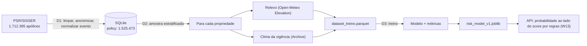

# Dados e modelo — fontes, pipeline e resultados

Fonte da verdade sobre **de onde vêm os dados** e **como o modelo é treinado e avaliado**.
Toda fonte nova entra aqui com ficha completa. Verificado em 19/09/2026.

## Princípio

**Dado real primeiro.** Só usamos dado simulado quando não existe fonte aberta, e nesse caso ele
aparece rotulado como simulado no código, na API e na tela.

## Fontes de dados

### 1. PSR / SISSER — apólices e sinistros reais do seguro rural ⭐ (D1)

| Item | Valor |
|---|---|
| Órgão | Ministério da Agricultura e Pecuária (Mapa) |
| Portal | https://dados.agricultura.gov.br/dataset/sisser3 · Atlas: https://mapa-indicadores.agricultura.gov.br/publico/extensions/SISSER/SISSER.html |
| Arquivos | CSV e XLSX: **2006–2015**, **2016–2024**, **2025** + dicionário de dados em PDF |
| Licença | Creative Commons Attribution (CC-BY) |
| Formato | CSV com `;`, codificação **ISO-8859-1**, decimal com vírgula, datas `dd/mm/aaaa` |
| Granularidade | **uma linha por apólice**, com coordenada da propriedade |

Colunas que interessam (verificadas no arquivo de 2025):
`NM_RAZAO_SOCIAL` (seguradora) · `DT_INICIO_VIGENCIA` · `DT_FIM_VIGENCIA` · `NM_MUNICIPIO_PROPRIEDADE` ·
`SG_UF_PROPRIEDADE` · **`NR_DECIMAL_LATITUDE`** · **`NR_DECIMAL_LONGITUDE`** · `NM_CULTURA_GLOBAL` ·
`NR_AREA_TOTAL` · `VL_LIMITE_GARANTIA` · `VL_PREMIO_LIQUIDO` · `CD_GEOCMU` (código IBGE) ·
**`VALOR_INDENIZAÇÃO`** · **`EVENTO_PREPONDERANTE`** (a causa do sinistro).

> ⚠️ **LGPD:** o arquivo traz `NM_SEGURADO` (nome) e `NR_DOCUMENTO_SEGURADO` (documento parcial).
> Essas colunas são **descartadas na leitura** e nunca entram no banco nem no repositório (I5).

**Por que isso importa:** é sinistro **real**, com local, data, cultura e causa. Permite treinar e
validar o modelo com o que aconteceu de verdade, e conversar com a Sompo na língua dela.
**Limitação:** cobre seguro **agrícola** (lavoura), não seguro de máquinas. O elo com o nosso
problema é a exposição climática do local, não o dano à máquina. Declare isso sempre.

> ### ⚠️ O arquivo de 2006–2015 não serve para modelagem
>
> **Todas** as 430.843 apólices daquele CSV têm `DT_INICIO_VIGENCIA` igual a `DT_FIM_VIGENCIA`
> (430.843 de 430.843, conferido em 20/09/2026). Nenhuma linha de 2016 em diante tem o problema.
> Sem duração de vigência não há janela climática, e qualquer feature de período sai degenerada.
>
> **Consequência para todo mundo que usar a tabela `policy`:** a população utilizável é
> **2016–2024, com 1.048.419 apólices**, e a taxa real de sinistro indenizado nela é **18,2%** —
> não os 16,2% da base inteira, que estão diluídos pelas apólices de 2006–2015 (13,2%). Use 18,2%
> como a taxa de referência do problema.

#### Ficha da coleta (D1, executada em 19/09/2026)

| Item | Valor |
|---|---|
| Catálogo | `https://dados.agricultura.gov.br/api/3/action/package_show?id=sisser3` |
| ⚠️ User-agent | O portal responde **403** ao user-agent padrão de `curl`/`httpx`. `scripts/download_psr.py` envia um de navegador. |
| Baixado | 2006–2015 (162,6 MB) · 2016–2024 (296,7 MB) · 2025 (13,3 MB) · dicionário em PDF |
| Colunas do CSV | 38 |
| Onde ficam | `data/raw/` (fora do Git). Versionado: só `data/sample/psr_amostra.csv` |

**Duas formas de coordenada.** Só **8%** das linhas trazem `NR_DECIMAL_LATITUDE`/`NR_DECIMAL_LONGITUDE`
preenchidos; as outras **92%** trazem a coordenada em grau/minuto/segundo
(`NR_GRAU_LAT`, `NR_MIN_LAT`, `NR_SEG_LAT` e o hemisfério em `LATITUDE`). O pipeline usa a decimal
quando existe e **reconstrói** a partir do DMS quando falta — sem isso, perderíamos 92% da base. A
coluna `coordinate_source` da tabela `policy` guarda de onde veio cada coordenada.

**Vocabulário de `EVENTO_PREPONDERANTE`.** **16 valores distintos** nos três arquivos (união de
2006–2015, 2016–2024 e 2025; contados em 19/09/2026), mapeados em 7 categorias
(`app/services/psr_ingest.py::EVENT_MAP`). O dicionário tem 19 chaves: as 16 observadas mais 3
**sinônimos defensivos** que não ocorrem em nenhum arquivo (`ESTIAGEM`, `VENDAVAL`, `INUNDACAO`),
guardados para o caso de o Mapa mudar o texto:

| Categoria | Textos observados (ocorrências) | Sinônimo defensivo |
|---|---|---|
| `seca` | SECA (180.687) | ESTIAGEM |
| `chuva_excessiva` | CHUVA EXCESSIVA (19.773), INUNDAÇÃO/TROMBA D´ÁGUA (4.069) | INUNDACAO |
| `granizo` | GRANIZO (75.823) | — |
| `geada` | GEADA (42.746) | — |
| `vento` | VENTOS FORTES/FRIOS (5.518) | VENDAVAL |
| `outros` | DEMAIS CAUSAS (44.089), MORTE (1.554), VARIAÇÃO EXCESSIVA DE TEMPERATURA (1.273), INCÊNDIO (610), QUEDA DE PARREIRAL (297), RAIO (61), VARIAÇÃO DE PREÇO (53), DOENÇAS E PRAGAS (34), PERDA DE QUALIDADE (31), REPLANTIO (6) | — |
| `sem_sinistro` | coluna vazia (`-`) | — |

> Detalhe que custou um bug: `INUNDAÇÃO/TROMBA D´ÁGUA` usa o acento agudo `´` (U+00B4), que se
> decompõe em **espaço + acento combinante** ao normalizar. A troca por `'` tem de vir **antes** de
> remover os acentos, senão o texto nunca casa e os **4.069** sinistros de inundação caem em
> `outros` — 19% de tudo que é `chuva_excessiva`.

#### Relatório de qualidade da ingestão (19/09/2026)

Gerado por `uv run --project api python scripts/load_psr.py --json`.

| Arquivo | Lidas | Mantidas | Descartadas | Com indenização |
|---|---|---|---|---|
| PSR 2006–2015 | 617.683 | 430.843 | 186.840 | 56.885 (13,2%) |
| PSR 2016–2024 | 1.048.565 | 1.048.493 | 72 | 190.412 (18,2%) |
| PSR 2025 | 46.137 | 46.137 | 0 | 0 (0,0%) — vigência em aberto |
| **Total** | **1.712.385** | **1.525.473** | **186.912 (10,9%)** | **247.297 (16,2%)** |

Descartes por motivo (nada é descartado em silêncio):

| Motivo | Linhas |
|---|---|
| `sem_coordenada` (nem decimal nem DMS; quase todas de 2006–2015) | 186.330 |
| `coordenada_fora_do_brasil` (fora da caixa lat −34…5,5 / lon −74,5…−34) | 543 |
| `vigencia_longa_demais` (> 1.100 dias entre início e fim) | 37 |
| `valor_negativo` | 1 |
| `duplicada_id_proposta` | 1 |

Correções, em vez de descarte: **39.159** linhas tinham `NR_AREA_TOTAL` igual a 0 (pecuária e
floresta preenchem `NR_ANIMAL`, não a área). A área vira nula e a linha é mantida — jogar fora o
sinistro por causa de um campo opcional seria pior.

**Mantidas com ressalva: 430.843** linhas (28,2% das mantidas) com `vigencia_de_um_dia` — início
igual a fim, portanto sem janela climática. São o arquivo de 2006–2015 inteiro (ver o aviso na
ficha da fonte, acima). Não são descartadas porque a apólice é íntegra em tudo o mais; quem monta
feature de período é que as exclui. O relatório da ingestão imprime o número e a consequência, para
ninguém descobrir isso só duas features adiante — foi o que aconteceu da primeira vez.

Distribuição por evento (linhas mantidas):

| Evento | Linhas | % |
|---|---|---|
| `sem_sinistro` | 1.167.103 | 76,5% |
| `seca` | 173.835 | 11,4% |
| `granizo` | 67.752 | 4,4% |
| `outros` | 47.727 | 3,1% |
| `geada` | 41.722 | 2,7% |
| `chuva_excessiva` | 21.891 | 1,4% |
| `vento` | 5.443 | 0,4% |

Top 10 UFs: PR 561.288 · RS 329.595 · SP 211.483 · SC 112.209 · MG 97.475 · GO 73.495 ·
MS 71.723 · MT 24.118 · ES 12.456 · BA 9.862 (27 UFs no total).

**Leitura para o modelo (D3):** o evento útil para o nosso problema (`chuva_excessiva` + `granizo` +
`vento` = 95.086 linhas, **6,2%**) é raro. Por isso as métricas do D3 são AUC-PR, recall e precisão,
e não acurácia.

#### O que o pipeline faz (`api/app/services/psr_ingest.py`)

`read_psr` → `clean` → `load_to_db`, com `ingest_file` juntando tudo em blocos de 100 mil linhas.

1. **Extrair** — `;`, ISO-8859-1, `-` como vazio, tudo como texto. A leitura passa uma **lista
   branca** de 24 colunas ao pandas: `NM_SEGURADO` e `NR_DOCUMENTO_SEGURADO` não são lidos.
2. **Validar e limpar** — cada descarte é contado por motivo em `QualityReport`.
3. **Transformar** — decimal com vírgula → float; `dd/mm/aaaa` → data; DMS → grau decimal;
   `EVENTO_PREPONDERANTE` → `event_category`.
4. **Carregar** — tabela `policy`, com `UNIQUE (proposal_id)`: recarregar o mesmo arquivo é
   idempotente.

**Limitação da coordenada reconstruída.** O DMS do SISSER vem com **segundos inteiros**, e 1" de
latitude ≈ 31 m. Então as 92% de coordenadas vindas de DMS têm resolução de ~30 m (até ~44 m de erro
diagonal), contra os ~0,1 m das decimais. É fino o bastante para o DEM de 90 m da Open-Meteo (D2),
mas não serve para distinguir talhões vizinhos. `coordinate_source` diz qual é qual.

A amostra versionada (`data/sample/psr_amostra.csv`, 453 linhas reais, 126 KB, com 55 linhas
por categoria de evento) é gerada por
`scripts/build_psr_sample.py`, estratificada por evento, e mantém as colunas pessoais **com os
valores trocados** por `ANONIMIZADO` e `***` — de propósito, para que o teste de LGPD prove que o
pipeline as descarta mesmo quando elas estão presentes.

### 2. Open-Meteo — relevo e clima (I1, já em uso)

> ### ⚠️ Leia antes de chamar a Elevation API
>
> **A documentação diz 100 pontos por chamada. Na prática ela recusa multiponto.** O endpoint
> pondera a chamada pelo **número de pontos**, e passar de ~10 devolve **429 Too Many Requests**
> por mais que se espere entre as chamadas.
>
> Medido em 20/09/2026, 6 chamadas seguidas de cada tipo:
>
> | Pontos por chamada | Pausa | Resultado |
> |---|---|---|
> | 9 | 0,5 s | 6 de 6 ✅ |
> | 27 | 1 s | 1 de 6 ✅ |
> | 99 | 2 s | 0 de 6 ❌ |
> | 99 | 5 s | 0 de 6 ❌ |
>
> **Mande poucos pontos por chamada** (a D2 manda 9) e limite o ritmo. Uma rajada de chamadas de
> 99 pontos derruba a cota em ~90 segundos e deixa **todo o time** sem elevação por ~20 minutos —
> aconteceu em 19/09 e travou verificações da W2/W3/W4.
>
> **As cotas são por subdomínio, e independentes:** `api.open-meteo.com` (elevação e previsão),
> `archive-api.open-meteo.com` (ERA5) e `historical-forecast-api.open-meteo.com` têm budgets
> diários separados. Estourar um não derruba os outros — e o erro é explícito no corpo da
> resposta: `{"error":true,"reason":"Daily API request limit exceeded. Please try again
> tomorrow."}`.


| Item | Valor |
|---|---|
| Elevação | `https://api.open-meteo.com/v1/elevation` — Copernicus DEM GLO-90 (~90 m), até 100 pontos por chamada |
| Previsão | `https://api.open-meteo.com/v1/forecast` — horária, `past_days` e `forecast_days` |
| Histórico recente | `https://historical-forecast-api.open-meteo.com/v1/forecast` (≥ 2022) |
| Arquivo (ERA5) | `https://archive-api.open-meteo.com/v1/archive` (sem `cape`; umidade do solo é `soil_moisture_0_to_7cm`) |
| Chave | não precisa · **Limite**: ~10 mil chamadas/dia no uso gratuito |
| Reset da cota | **00:00 UTC** (21:00 no horário de Brasília). A cota é **por subdomínio e independente**: `archive-api` pode estar bloqueado enquanto elevação e previsão respondem normalmente *(medido em 20/09/2026)* |

### 3. TOPODATA / INPE — relevo em 30 m (melhoria futura)

SRTM refinado para ~30 m, **só Brasil**, com inclinação, orientação e curvatura já calculadas.
http://www.dsr.inpe.br/topodata/ · https://data.inpe.br/dados/topodata/
Entrega mais detalhe que o DEM de 90 m, mas exige baixar e processar GeoTIFF por quadrícula.
**Decisão:** fora do MVP. Fica como evolução declarada no pitch.

### 4. SoilGrids / ISRIC — solo (avaliado e **NÃO usado**)

> ⚠️ **Não entrou no sistema.** Não há uma linha de código que chame este serviço, e ele não
> aparece no [diagrama de arquitetura](arquitetura.md). Está descrito aqui porque foi avaliado, e
> porque a avaliação é parte da justificativa dos ajustes do dataset — **não** porque seja fonte
> de dado do produto. O motivo da exclusão está em [Solo (opcional, não usado)](#solo-opcional-não-usado).

`https://rest.isric.org/soilgrids/v2.0/properties/query?lon=&lat=&property=clay&depth=0-5cm&value=mean`
Testado em 19/09/2026: respondeu **200**. Argila e areia ajudam a explicar por que o mesmo volume de
chuva encharca um solo e não outro. A documentação avisa que o serviço às vezes fica indisponível.

### 5. DATASUS (SIM/SIH) — acidentes com maquinaria agrícola (CID-10 **W30**)

Óbitos (SIM) e internações (SIH) com causa externa **W30 "Contato com maquinaria agrícola"**, por
município e data. É o dado público mais próximo do **nosso** problema (dano à pessoa por máquina).
Acesso: pacote Python **PySUS** (2.11.2 no PyPI) ou o pacote R `microdatasus`; também via TabNet.
⚠️ Em 19/09/2026, `ftp.datasus.gov.br` **não respondeu** a partir do ambiente de desenvolvimento
usado. Testar na rede do time antes de depender disso. **Plano B:** usar como estatística de
contexto no pitch (T3), sem entrar no modelo.

### 6. INMET — estações meteorológicas reais

BDMEP (histórico): https://bdmep.inmet.gov.br/ · Dados históricos por ano: https://portal.inmet.gov.br/dadoshistoricos
⚠️ Em 19/09/2026 o domínio do INMET **recusou conexão** a partir do nosso ambiente. Se funcionar na
rede do time, vale usar para **validar** a previsão da Open-Meteo contra a estação mais próxima.

### 7. CEMADEN — pluviômetros automáticos (validação de chuva)

Mais de 3.800 pluviômetros, leitura a cada 10 min, em 1.295 municípios; download por UF/mês pelo Mapa
Interativo (http://www2.cemaden.gov.br/mapainterativo/ → "Baixar dados"). Dados em **UTC**.
Não tem API aberta documentada: o download é por formulário. Bom para validar um caso pontual.

### 8. Outras fontes de contexto (pitch, T1 e T3)

- **SmartLab / Observatório de SST (MPT + OIT)**: acidentes de trabalho por CNAE, inclusive agricultura — https://smartlab.mpt.mp.br/sst
- **AEAT / Ministério do Trabalho**: anuário de acidentes do trabalho
- **IBGE Censo Agropecuário**: tratores e máquinas por município
- **SUSEP**: estatísticas de prêmios e sinistros por ramo

## Pipeline (D1 → D2 → D3)



## Dataset de treino (D2)

Gerado por `scripts/build_dataset.py` a partir da tabela `policy` (D1), do relevo (W2) e do clima
da vigência (I1). Uma linha por apólice. **Ficha em `data/dataset_treino.json`**, ao lado do
parquet, com data de geração, tamanho da amostra, semente, contagem de chamadas e taxa de cada
rótulo.

### Como a amostra é escolhida

Estratificada por **UF × ano da apólice × grupo de cultura × rótulo**, com **alocação
proporcional** e arredondamento por maiores restos. Proporcional, não balanceada: a taxa real de
sinistro tem de sobreviver à amostragem, porque é ela que a D3 vai enfrentar.

Duas exclusões, antes de amostrar:

1. **2025 inteiro** — a vigência não terminou, então a ausência de indenização é **censura**, não
   rótulo negativo. Treinar com elas como 0 ensinaria o modelo a errar. (46.137 apólices)
2. **Vigência menor que 30 dias** — ver o achado abaixo. (430.917 apólices)

> ⚠️ **O arquivo de 2006–2015 não serve para o modelo.** Conferido em 20/09/2026: **todas** as
> 430.843 apólices daquele CSV têm `DT_INICIO_VIGENCIA` igual a `DT_FIM_VIGENCIA` — 430.843 de
> 430.843. Nenhuma linha de 2016 em diante tem o problema. Com vigência de um dia não existe
> janela climática: `rain_total_mm` sai 0 e `dry_spell_max_days` sai 1 para todo mundo, por
> construção. O problema só apareceu ao inspecionar as primeiras 411 linhas geradas, em que 124
> (30%) tinham `weather_days = 1`. Sem esse filtro, **29% da cota da Open-Meteo iria para
> produzir ruído**. A D1 não pegou isso porque valida `fim < início` e vigência longa demais, não
> vigência de duração zero.

**População utilizável: 1.048.419 apólices de 2016 a 2024**, com **18,2%** de sinistro indenizado
— acima dos 16,2% da base inteira, porque as apólices descartadas de 2006–2015 tinham taxa menor
(13,2%).

### Features

Toda feature leva a unidade no nome e **só usa informação disponível até o fim da vigência**.

| Grupo | Feature | Unidade / valores | De onde vem |
|---|---|---|---|
| Relevo | `slope_mean_deg` | graus | média da inclinação nas 9 células |
| Relevo | `slope_max_deg` | graus | máximo da inclinação |
| Relevo | `elevation_mean_m` | metros | média da elevação |
| Relevo | `elevation_range_m` | metros | máx − mín da elevação |
| Relevo | `aspect_label` | N, NE, L, SE, S, SO, O, NO | orientação da **célula central** (a sede) |
| Relevo | `pct_lowland` | % | células classificadas `lowland` (regras-de-risco §1) |
| Relevo | `pct_exposed` | % | células classificadas `exposed` |
| Clima | `rain_total_mm` | mm | soma da chuva na vigência |
| Clima | `rain_max_day_mm` | mm | maior chuva diária |
| Clima | `days_rain72h_ge30` | dias | dias com `rain_72h_mm ≥ 30` (solo encharcado, §2) |
| Clima | `days_thunderstorm` | dias | dias com `weather_code` 95/96/99 |
| Clima | `gust_max_kmh` | km/h | rajada máxima |
| Clima | `temp_max_c` | °C | temperatura máxima |
| Clima | `rh_min_pct` | % | umidade relativa mínima |
| Clima | `dry_spell_max_days` | dias | maior sequência com `rain_72h_mm < 10` (solo seco, §2) |
| Clima | `weather_days` | dias | dias de clima efetivamente usados |
| Contexto | `crop`, `crop_group` | texto | cultura; as 6 mais frequentes + `outras` |
| Contexto | `area_ha` | hectares | área segurada |
| Contexto | `state`, `municipality`, `geocode_ibge` | — | localização |
| Contexto | `lat`, `lon` | graus | ponto da propriedade |
| Contexto | `coordinate_source` | `decimal` / `dms` | precisão da coordenada (~0,1 m × ~30 m) |
| Contexto | `policy_year`, `start_month`, `coverage_days` | — | quando e por quanto tempo |
| Rótulo | `target_claim` | 0/1 | indenização > 0 |
| Rótulo | `target_rain_claim` | 0/1 | indenização > 0 **e** evento `chuva_excessiva` ou `granizo` |

O relevo vem de uma grade **3 × 3 de ±0,005°** (~1,1 km de lado) ao redor do ponto, com as mesmas
funções do W2 (`build_grid`, `compute_slope_aspect`, `classify_cells`) e a mesma convenção de
**centros de célula** (regras-de-risco §1). A grade é pequena de propósito: o ponto do PSR é a
sede da propriedade, não o talhão.

### Como o vazamento é barrado

A janela climática vai **do início ao fim da vigência**, limitada a 12 meses. Nada que só se saiba
depois disso entra.

As chamadas à Open-Meteo, porém, são feitas numa janela **arredondada para meses inteiros**, para
que muitas apólices dividam a mesma resposta. O recorte para a vigência exata acontece **depois**,
em `clip_to_coverage`, antes de qualquer indicador ser calculado — o arredondamento é de cache, não
de conteúdo. O teste `test_build_features_nao_usa_clima_posterior_ao_fim_da_vigencia` prova isso:
100 mm de chuva num dia posterior ao fim da vigência não mudam nenhuma feature, enquanto 100 mm num
dia de dentro mudam.

### Orçamento de chamadas da Open-Meteo

O plano gratuito dá ~10 mil chamadas/dia, e os subdomínios têm **cotas separadas**:
`api.open-meteo.com` (elevação e previsão) tem budget próprio, distinto de `archive-api` e
`historical-forecast-api`.

| Chamada | Agrupamento | Economia medida |
|---|---|---|
| Clima | uma por **célula de 0,25° × janela de meses** | **1,9%** |
| Elevação | uma por **coordenada distinta** (9 pontos) | **0,1%** |

> O agrupamento está implementado, mas **rendeu pouco**: 1.184 apólices geraram 1.161 grupos de
> clima. A razão é a dispersão da amostra — 1.184 propriedades espalhadas por 9 safras e 15 UFs
> quase nunca caem na mesma célula de 27 km **na mesma janela de meses**. O agrupamento pagaria
> muito mais numa amostra densa (um município, uma safra), que é o caso de uso da W3, não o da D2.
> Registrado aqui para que ninguém repita a expectativa errada.

> ⚠️ **Medido em 20/09/2026.** A Elevation API **documenta** 100 pontos por chamada, mas na prática
> recusa multiponto: com 9 pontos e 0,5 s de pausa, 6 chamadas seguidas passam; com 27 pontos,
> 5 de 6 voltam **429**; com 99 pontos, todas voltam 429, mesmo com 5 s de pausa. O endpoint
> pondera a chamada pelo número de pontos. Por isso vai **uma propriedade por chamada**, com um
> limitador de ritmo próprio, mais lento que o do histórico. A economia que resta é a
> deduplicação de coordenadas repetidas.

O script é **retomável**: cada linha pronta é gravada na hora em `data/.dataset_parcial.jsonl`, e
a execução seguinte pula as apólices que já têm linha. `--consolidar` fecha o parquet a partir do
parcial **sem gastar nenhuma chamada**. A elevação é buscada **sob demanda**, uma propriedade por
vez, e não toda de uma vez no começo: assim uma queda no meio não joga fora a cota já gasta.

### Ficha do dataset gerado (20/09/2026)

| Item | Valor |
|---|---|
| Arquivo | `data/dataset_treino.parquet` (+ ficha em `dataset_treino.json`) |
| Linhas | **1.184** (amostra pedida: 2.500 — ver a limitação abaixo) |
| Período | 2016 a 2024, as 9 safras representadas |
| Cobertura | 14 UFs (PR 435 · RS 241 · SP 158 · SC 96 · MG 94 · MS 65 · GO 54 · MT 19 · demais 22), 28 culturas |
| `target_claim` | 199 positivos (**16,8%**) |
| `target_rain_claim` | 49 positivos (**4,1%**) |
| Coordenada | 1.058 de DMS (~30 m) · 126 decimais |
| Janela climática | mediana de 303 dias; mínimo 67 |
| Chamadas consumidas | 1.184 elevação + 774 archive + 387 historical = **2.345** (mais 34 recusas absorvidas por recuo exponencial) |

> ⚠️ **Por que 1.184 e não 2.500.** A `archive-api` (ERA5, usada para vigências anteriores a 2022)
> respondeu `{"error":true,"reason":"Daily API request limit exceeded. Please try again
> tomorrow."}` no meio da geração. A cota **diária** de cada subdomínio é independente, e a do
> archive acabou primeiro porque 775 das 1.184 linhas são de 2016–2021. Elevação e
> `historical-forecast-api` continuaram respondendo 200.
>
> Não insistimos: a amostra parada é **não enviesada** (as apólices são embaralhadas antes de
> serem processadas, então parar no meio dá um subconjunto aleatório dos estratos), o parcial está
> salvo e **um comando completa o dataset** quando a cota virar o dia:
>
> ```bash
> uv run --project api python scripts/build_dataset.py -n 2500   # retoma nas 1.184 já prontas
> ```
>
> Completar **não** exige refazer nada: as 1.184 linhas prontas não consomem chamada de novo.

### Solo (opcional, não usado)

`clay_pct` e `sand_pct` do SoilGrids ficaram **fora** desta versão: cada ponto exige uma chamada
própria a um serviço que a própria documentação avisa ser instável, e o orçamento de chamadas já
estava apertado com relevo e clima. Fica declarado como evolução.

## Resultados do modelo (D3)

Gerado por `scripts/train_model.py` em 20/09/2026, sobre `data/dataset_treino.parquet` (1.184
linhas). Os números abaixo são exatamente os do artefato
`api/app/data/model/risk_model_v1.json` — nenhum foi escrito à mão.

**Divisão temporal, sem embaralhar:** treino ≤ 2021 (775) · validação 2022–2023 (254) · **teste
2024 (155)**. 2025 não serve como teste: as apólices estão em vigência e a ausência de indenização
é censura, não rótulo 0.

### TESTE (2024) — alvo `target_claim`, 8 positivos em 155

| Modelo | AUC-ROC | AUC-PR | Recall | Precisão | Limiar | VP | FP | FN | VN |
|---|---|---|---|---|---|---|---|---|---|
| **Baseline (regras)** | **0,622** | **0,091** | 0,875 | 0,053 | 0,083 | 7 | 126 | 1 | 21 |
| Regressão logística (escolhida) | 0,605 | 0,073 | 1,000 | 0,055 | 0,142 | 8 | 138 | 0 | 9 |
| Floresta aleatória | 0,461 | 0,051 | 1,000 | 0,059 | 0,352 | 8 | 128 | 0 | 19 |

### VALIDAÇÃO (2022–2023) — usada para escolher, 29 positivos em 254

| Modelo | AUC-ROC | AUC-PR | Recall | Precisão | Limiar |
|---|---|---|---|---|---|
| Baseline (regras) | 0,521 | 0,118 | 0,897 | 0,130 | 0,083 |
| Regressão logística | 0,544 | 0,124 | 1,000 | 0,124 | 0,142 |
| Floresta aleatória | 0,545 | 0,126 | 0,966 | 0,128 | 0,352 |

### 🔴 O modelo NÃO supera o baseline. E a amostra não permitiria provar que supera.

No conjunto de teste, o baseline por regras tem **AUC-PR 0,091 contra 0,073** do modelo escolhido,
e **AUC-ROC 0,622 contra 0,605**. Publicamos assim porque é o resultado, e porque
[regras-de-risco §11](regras-de-risco.md) já previa este desfecho: *"se o modelo não superar o
baseline, as regras seguem no comando"*.

**Mas a frase honesta não para aí.** A pergunta certa é se 0,073 contra 0,091 é diferença de
verdade. Bootstrap pareado da diferença de AUC-PR no teste (10.000 reamostragens, calculado por
`compare_on_test` e gravado no artefato):

| | Valor |
|---|---|
| Diferença observada (modelo − baseline) | **−0,019** |
| IC 95% da diferença | **[−0,128, +0,038]** |
| P(modelo > baseline) | **0,26** |

**O zero está dentro do intervalo.** Com 8 positivos, os dois são estatisticamente
**indistinguíveis**: o modelo não superou o baseline — e **com esta amostra não seria possível
demonstrar superioridade nem se ela existisse**. O que se pode afirmar é que não há evidência de
ganho, não que o ganho seja zero.

**Na validação (2022–2023, 29 positivos), o modelo ganha:** AUC-PR **0,124 contra 0,118** do
baseline. A inversão entre validação e teste não contradiz a leitura deste documento — **é a
própria tese do deslocamento temporal**. O modelo aprende a estrutura de um período e a perde no
seguinte, porque o que muda de um ano para o outro (o regime macroclimático) é maior do que o que
ele conseguiu aprender. As regras, que não aprendem nada dos dados, não sofrem esse deslocamento —
e é por isso que elas seguem no comando.

**Por que o modelo escolhido é a regressão logística e não a floresta.** Na validação, a floresta
ganhou por 0,002 de AUC-PR (0,126 × 0,124). Com 29 positivos, isso é ruído de amostragem, não
sinal. `select_model` aplica a **regra de um erro padrão**: o candidato mais complexo só desbanca
o mais simples se ganhar por mais que o erro padrão da diferença, estimado por bootstrap pareado
(400 reamostragens). A floresta não passou nesse teste — e, no conjunto de teste, de fato saiu
pior (AUC-PR 0,051). A decisão foi tomada **sem olhar o teste**.

### Importância das variáveis

Permutação sobre a AUC-PR, medida na validação (a média de queda da métrica ao embaralhar a
coluna):

| Variável | Importância |
|---|---|
| `state` | +0,0169 |
| `dry_spell_max_days` | +0,0060 |
| `elevation_range_m` | +0,0046 |
| `slope_mean_deg` | +0,0037 |
| `days_rain72h_ge30` | +0,0023 |
| `elevation_mean_m` | +0,0006 |

Nenhuma variável chega perto de explicar o rótulo: a maior importância (`state`, +0,017) é da
mesma ordem do próprio ruído. Ou seja, **a UF explica mais que todo o relevo e todo o clima da
vigência somados** — o que faz sentido, porque a UF carrega cultura, regime de chuva e prática
agrícola de uma vez só.

### O que este resultado realmente diz

**A taxa de sinistro é dominada pelo ano, não pelo local.** No dataset, ela varia de **5,0% (2017)
a 41,3% (2021)** — oito vezes. O modelo treinou em anos que somam 20,9% de sinistro e foi testado
num ano de 5,2%. Nenhuma feature de relevo ou de clima da safra compensa um deslocamento desse
tamanho, e é exatamente isso que a divisão temporal existe para expor: uma divisão aleatória teria
escondido o problema e dado um número bonito e falso.

Para o pitch, a leitura honesta é: **com 9 safras não dá para aprender o regime macroclimático**,
e o que a solução entrega hoje é o motor de regras, explicável e calibrado no documento. O modelo
fica como instrumento pronto — treino, avaliação e artefato versionado — que melhora quando houver
mais safras e um rótulo mais próximo do problema (dano à máquina, não perda de lavoura).

### Alvo `target_rain_claim`: não avaliável

Tem **49 positivos no dataset inteiro e apenas 2 no conjunto de teste**. Com 2 positivos, recall e
precisão saltam de 0 para 0,5 com um acerto, e a AUC-PR não tem significado estatístico. As
métricas desse alvo são **indicativas, não conclusivas**, e a conclusão do projeto se apoia no
`target_claim`. Rodar com `--alvo target_rain_claim` continua funcionando, para quando o dataset
crescer.

### Limiar

Escolhido **na validação** por F-beta com **β = 2** — recall pesa 4× mais que precisão. A razão é o
custo assimétrico do erro: deixar de avisar custa uma máquina tombada; avisar à toa custa uma
manhã parada. O limiar do modelo escolhido é **0,142**, e o do baseline, **0,083**. Nenhum dos dois
foi ajustado no conjunto de teste.

### Como reproduzir

```bash
uv run --project api python scripts/train_model.py                      # target_claim
uv run --project api python scripts/train_model.py --alvo target_rain_claim --nao-salvar
```

Quando o dataset for completado para 2.500 linhas, **o mesmo comando** refaz tudo e reescreve o
artefato e este quadro de métricas.

## Conclusão: o que decide o risco hoje, e por quê

**A solução decide pelas regras, não pelo modelo.** O mapa de risco, o limite dinâmico de
inclinação e o alerta no equipamento saem todos do motor de
[regras-de-risco.md](regras-de-risco.md) — explicável (cada alerta traz o motivo e o número que o
disparou) e capaz de rodar offline no ESP32.

**O modelo foi construído, avaliado e não entrou no lugar delas.** No teste (2024, nunca usado
para escolher nada), o baseline por regras marca **AUC-PR 0,091 e AUC-ROC 0,622** contra **0,073 e
0,605** da regressão logística. O modelo perde. Mantivemos as regras no comando — o desfecho que
`regras-de-risco.md` §11 já previa por escrito, antes de sabermos o resultado.

**O que impediu não foi o algoritmo, foi o dado:**

1. **O ano manda mais que o lugar.** A taxa de sinistro do PSR vai de **5,0% (2017) a 41,3%
   (2021)** — oito vezes. O modelo treinou em safras que somam 20,9% e foi testado numa de 5,2%.
   Nenhuma variável de relevo ou clima compensa isso, e nove safras não bastam para aprender o
   regime macroclimático que o causa.
2. **O rótulo não é o nosso problema.** O PSR registra perda de **lavoura**, não acidente com
   **máquina**. Usamos exposição climática do local como aproximação: o elo existe, mas é
   indireto, e é a maior fonte de erro do trabalho.
3. **A amostra é pequena.** 1.184 apólices, 8 sinistros no teste — tamanho em que a diferença
   entre dois modelos cabe dentro do ruído.

**Mostramos esse resultado em vez de maquiá-lo.** Uma divisão aleatória, em vez da temporal, teria
misturado safras entre treino e teste e dado uma métrica bem mais bonita — e falsa, porque na
operação real o modelo sempre prevê um ano que ainda não aconteceu. A divisão temporal é o que
expôs o problema, e o problema é a informação mais útil que este trabalho produziu.

**O que destravaria é exatamente o que a parceria com a Sompo oferece:** a base de **sinistros de
máquinas agrícolas** da seguradora, com data, local, equipamento e causa. Trocar o rótulo
aproximado pelo real ataca as três limitações de uma vez — alinha o alvo ao problema, multiplica
os eventos e permite calibrar os limiares das regras com sinistro observado, em vez dos valores de
referência da literatura que usamos hoje. `scripts/train_model.py` retreina, recompara com o
baseline e reescreve o artefato com **um comando**.

Até lá, a entrega é honesta sobre o que é: **um motor de regras calibrado e explicável, com um
modelo preditivo instrumentado ao lado, medido e declarado insuficiente.**

## Limitações a declarar no pitch

1. O rótulo vem do **seguro agrícola**, não de sinistros de máquinas. É uma aproximação da exposição climática.
2. Quem contrata seguro subvencionado não é uma amostra aleatória do campo (viés de seleção).
3. O DEM de 90 m suaviza encostas curtas.
4. A amostra é de alguns milhares de apólices, limitada pelo número de chamadas às APIs.
5. Os limiares das regras ainda não foram calibrados com base de sinistro de máquinas (é o que a parceria com a Sompo destravaria).
