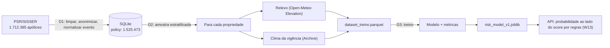

# Dados e modelo — fontes, pipeline e resultados

Fonte da verdade sobre **de onde vêm os dados** e **como o modelo é treinado e avaliado**.
Toda fonte nova entra aqui com ficha completa. Verificado em 19/09/2026.

## Princípio

**Dado real primeiro.** Só usamos dado simulado quando não existe fonte aberta, e nesse caso ele
aparece rotulado como simulado no código, na API e na tela.

## Fontes de dados

### 1. PSR / SISSER — apólices e sinistros reais do seguro rural ⭐ (D1)

| Item | Valor |
|---|---|
| Órgão | Ministério da Agricultura e Pecuária (Mapa) |
| Portal | https://dados.agricultura.gov.br/dataset/sisser3 · Atlas: https://mapa-indicadores.agricultura.gov.br/publico/extensions/SISSER/SISSER.html |
| Arquivos | CSV e XLSX: **2006–2015**, **2016–2024**, **2025** + dicionário de dados em PDF |
| Licença | Creative Commons Attribution (CC-BY) |
| Formato | CSV com `;`, codificação **ISO-8859-1**, decimal com vírgula, datas `dd/mm/aaaa` |
| Granularidade | **uma linha por apólice**, com coordenada da propriedade |

Colunas que interessam (verificadas no arquivo de 2025):
`NM_RAZAO_SOCIAL` (seguradora) · `DT_INICIO_VIGENCIA` · `DT_FIM_VIGENCIA` · `NM_MUNICIPIO_PROPRIEDADE` ·
`SG_UF_PROPRIEDADE` · **`NR_DECIMAL_LATITUDE`** · **`NR_DECIMAL_LONGITUDE`** · `NM_CULTURA_GLOBAL` ·
`NR_AREA_TOTAL` · `VL_LIMITE_GARANTIA` · `VL_PREMIO_LIQUIDO` · `CD_GEOCMU` (código IBGE) ·
**`VALOR_INDENIZAÇÃO`** · **`EVENTO_PREPONDERANTE`** (a causa do sinistro).

> ⚠️ **LGPD:** o arquivo traz `NM_SEGURADO` (nome) e `NR_DOCUMENTO_SEGURADO` (documento parcial).
> Essas colunas são **descartadas na leitura** e nunca entram no banco nem no repositório (I5).

**Por que isso importa:** é sinistro **real**, com local, data, cultura e causa. Permite treinar e
validar o modelo com o que aconteceu de verdade, e conversar com a Sompo na língua dela.
**Limitação:** cobre seguro **agrícola** (lavoura), não seguro de máquinas. O elo com o nosso
problema é a exposição climática do local, não o dano à máquina. Declare isso sempre.

> ### ⚠️ O arquivo de 2006–2015 não serve para modelagem
>
> **Todas** as 430.843 apólices daquele CSV têm `DT_INICIO_VIGENCIA` igual a `DT_FIM_VIGENCIA`
> (430.843 de 430.843, conferido em 20/09/2026). Nenhuma linha de 2016 em diante tem o problema.
> Sem duração de vigência não há janela climática, e qualquer feature de período sai degenerada.
>
> **Consequência para todo mundo que usar a tabela `policy`:** a população utilizável é
> **2016–2024, com 1.048.419 apólices**, e a taxa real de sinistro indenizado nela é **18,2%** —
> não os 16,2% da base inteira, que estão diluídos pelas apólices de 2006–2015 (13,2%). Use 18,2%
> como a taxa de referência do problema.

#### Ficha da coleta (D1, executada em 19/09/2026)

| Item | Valor |
|---|---|
| Catálogo | `https://dados.agricultura.gov.br/api/3/action/package_show?id=sisser3` |
| ⚠️ User-agent | O portal responde **403** ao user-agent padrão de `curl`/`httpx`. `scripts/download_psr.py` envia um de navegador. |
| Baixado | 2006–2015 (162,6 MB) · 2016–2024 (296,7 MB) · 2025 (13,3 MB) · dicionário em PDF |
| Colunas do CSV | 38 |
| Onde ficam | `data/raw/` (fora do Git). Versionado: só `data/sample/psr_amostra.csv` |

**Duas formas de coordenada.** Só **8%** das linhas trazem `NR_DECIMAL_LATITUDE`/`NR_DECIMAL_LONGITUDE`
preenchidos; as outras **92%** trazem a coordenada em grau/minuto/segundo
(`NR_GRAU_LAT`, `NR_MIN_LAT`, `NR_SEG_LAT` e o hemisfério em `LATITUDE`). O pipeline usa a decimal
quando existe e **reconstrói** a partir do DMS quando falta — sem isso, perderíamos 92% da base. A
coluna `coordinate_source` da tabela `policy` guarda de onde veio cada coordenada.

**Vocabulário de `EVENTO_PREPONDERANTE`.** **16 valores distintos** nos três arquivos (união de
2006–2015, 2016–2024 e 2025; contados em 19/09/2026), mapeados em 7 categorias
(`app/services/psr_ingest.py::EVENT_MAP`). O dicionário tem 19 chaves: as 16 observadas mais 3
**sinônimos defensivos** que não ocorrem em nenhum arquivo (`ESTIAGEM`, `VENDAVAL`, `INUNDACAO`),
guardados para o caso de o Mapa mudar o texto:

| Categoria | Textos observados (ocorrências) | Sinônimo defensivo |
|---|---|---|
| `seca` | SECA (180.687) | ESTIAGEM |
| `chuva_excessiva` | CHUVA EXCESSIVA (19.773), INUNDAÇÃO/TROMBA D´ÁGUA (4.069) | INUNDACAO |
| `granizo` | GRANIZO (75.823) | — |
| `geada` | GEADA (42.746) | — |
| `vento` | VENTOS FORTES/FRIOS (5.518) | VENDAVAL |
| `outros` | DEMAIS CAUSAS (44.089), MORTE (1.554), VARIAÇÃO EXCESSIVA DE TEMPERATURA (1.273), INCÊNDIO (610), QUEDA DE PARREIRAL (297), RAIO (61), VARIAÇÃO DE PREÇO (53), DOENÇAS E PRAGAS (34), PERDA DE QUALIDADE (31), REPLANTIO (6) | — |
| `sem_sinistro` | coluna vazia (`-`) | — |

> Detalhe que custou um bug: `INUNDAÇÃO/TROMBA D´ÁGUA` usa o acento agudo `´` (U+00B4), que se
> decompõe em **espaço + acento combinante** ao normalizar. A troca por `'` tem de vir **antes** de
> remover os acentos, senão o texto nunca casa e os **4.069** sinistros de inundação caem em
> `outros` — 19% de tudo que é `chuva_excessiva`.

#### Relatório de qualidade da ingestão (19/09/2026)

Gerado por `uv run --project api python scripts/load_psr.py --json`.

| Arquivo | Lidas | Mantidas | Descartadas | Com indenização |
|---|---|---|---|---|
| PSR 2006–2015 | 617.683 | 430.843 | 186.840 | 56.885 (13,2%) |
| PSR 2016–2024 | 1.048.565 | 1.048.493 | 72 | 190.412 (18,2%) |
| PSR 2025 | 46.137 | 46.137 | 0 | 0 (0,0%) — vigência em aberto |
| **Total** | **1.712.385** | **1.525.473** | **186.912 (10,9%)** | **247.297 (16,2%)** |

Descartes por motivo (nada é descartado em silêncio):

| Motivo | Linhas |
|---|---|
| `sem_coordenada` (nem decimal nem DMS; quase todas de 2006–2015) | 186.330 |
| `coordenada_fora_do_brasil` (fora da caixa lat −34…5,5 / lon −74,5…−34) | 543 |
| `vigencia_longa_demais` (> 1.100 dias entre início e fim) | 37 |
| `valor_negativo` | 1 |
| `duplicada_id_proposta` | 1 |

Correções, em vez de descarte: **39.159** linhas tinham `NR_AREA_TOTAL` igual a 0 (pecuária e
floresta preenchem `NR_ANIMAL`, não a área). A área vira nula e a linha é mantida — jogar fora o
sinistro por causa de um campo opcional seria pior.

**Mantidas com ressalva: 430.843** linhas (28,2% das mantidas) com `vigencia_de_um_dia` — início
igual a fim, portanto sem janela climática. São o arquivo de 2006–2015 inteiro (ver o aviso na
ficha da fonte, acima). Não são descartadas porque a apólice é íntegra em tudo o mais; quem monta
feature de período é que as exclui. O relatório da ingestão imprime o número e a consequência, para
ninguém descobrir isso só duas features adiante — foi o que aconteceu da primeira vez.

Distribuição por evento (linhas mantidas):

| Evento | Linhas | % |
|---|---|---|
| `sem_sinistro` | 1.167.103 | 76,5% |
| `seca` | 173.835 | 11,4% |
| `granizo` | 67.752 | 4,4% |
| `outros` | 47.727 | 3,1% |
| `geada` | 41.722 | 2,7% |
| `chuva_excessiva` | 21.891 | 1,4% |
| `vento` | 5.443 | 0,4% |

Top 10 UFs: PR 561.288 · RS 329.595 · SP 211.483 · SC 112.209 · MG 97.475 · GO 73.495 ·
MS 71.723 · MT 24.118 · ES 12.456 · BA 9.862 (27 UFs no total).

**Leitura para o modelo (D3):** o evento útil para o nosso problema (`chuva_excessiva` + `granizo` +
`vento` = 95.086 linhas, **6,2%**) é raro. Por isso as métricas do D3 são AUC-PR, recall e precisão,
e não acurácia.

#### O que o pipeline faz (`api/app/services/psr_ingest.py`)

`read_psr` → `clean` → `load_to_db`, com `ingest_file` juntando tudo em blocos de 100 mil linhas.

1. **Extrair** — `;`, ISO-8859-1, `-` como vazio, tudo como texto. A leitura passa uma **lista
   branca** de 24 colunas ao pandas: `NM_SEGURADO` e `NR_DOCUMENTO_SEGURADO` não são lidos.
2. **Validar e limpar** — cada descarte é contado por motivo em `QualityReport`.
3. **Transformar** — decimal com vírgula → float; `dd/mm/aaaa` → data; DMS → grau decimal;
   `EVENTO_PREPONDERANTE` → `event_category`.
4. **Carregar** — tabela `policy`, com `UNIQUE (proposal_id)`: recarregar o mesmo arquivo é
   idempotente.

**Limitação da coordenada reconstruída.** O DMS do SISSER vem com **segundos inteiros**, e 1" de
latitude ≈ 31 m. Então as 92% de coordenadas vindas de DMS têm resolução de ~30 m (até ~44 m de erro
diagonal), contra os ~0,1 m das decimais. É fino o bastante para o DEM de 90 m da Open-Meteo (D2),
mas não serve para distinguir talhões vizinhos. `coordinate_source` diz qual é qual.

A amostra versionada (`data/sample/psr_amostra.csv`, 453 linhas reais, 126 KB, com 55 linhas
por categoria de evento) é gerada por
`scripts/build_psr_sample.py`, estratificada por evento, e mantém as colunas pessoais **com os
valores trocados** por `ANONIMIZADO` e `***` — de propósito, para que o teste de LGPD prove que o
pipeline as descarta mesmo quando elas estão presentes.

### 2. Open-Meteo — relevo e clima (I1, já em uso)

> ### ⚠️ Leia antes de chamar a Elevation API
>
> **A documentação diz 100 pontos por chamada. Na prática ela recusa multiponto.** O endpoint
> pondera a chamada pelo **número de pontos**, e passar de ~10 devolve **429 Too Many Requests**
> por mais que se espere entre as chamadas.
>
> Medido em 20/09/2026, 6 chamadas seguidas de cada tipo:
>
> | Pontos por chamada | Pausa | Resultado |
> |---|---|---|
> | 9 | 0,5 s | 6 de 6 ✅ |
> | 27 | 1 s | 1 de 6 ✅ |
> | 99 | 2 s | 0 de 6 ❌ |
> | 99 | 5 s | 0 de 6 ❌ |
>
> **Mande poucos pontos por chamada** (a D2 manda 9) e limite o ritmo. Uma rajada de chamadas de
> 99 pontos derruba a cota em ~90 segundos e deixa **todo o time** sem elevação por ~20 minutos —
> aconteceu em 19/09 e travou verificações da W2/W3/W4.
>
> **As cotas são por subdomínio, e independentes:** `api.open-meteo.com` (elevação e previsão),
> `archive-api.open-meteo.com` (ERA5) e `historical-forecast-api.open-meteo.com` têm budgets
> diários separados. Estourar um não derruba os outros — e o erro é explícito no corpo da
> resposta: `{"error":true,"reason":"Daily API request limit exceeded. Please try again
> tomorrow."}`.


| Item | Valor |
|---|---|
| Elevação | `https://api.open-meteo.com/v1/elevation` — Copernicus DEM GLO-90 (~90 m), até 100 pontos por chamada |
| Previsão | `https://api.open-meteo.com/v1/forecast` — horária, `past_days` e `forecast_days` |
| Histórico recente | `https://historical-forecast-api.open-meteo.com/v1/forecast` (≥ 2022) |
| Arquivo (ERA5) | `https://archive-api.open-meteo.com/v1/archive` (sem `cape`; umidade do solo é `soil_moisture_0_to_7cm`) |
| Chave | não precisa · **Limite**: 10.000 chamadas/dia (600/min · 5.000/h · 300.000/mês). **"Chamada" é unidade de peso, não requisição**: variáveis acima de 10 e janelas acima de 2 semanas contam como várias — ver [Orçamento de chamadas](#orçamento-de-chamadas-da-open-meteo) |
| Reset da cota | **00:00 UTC** (21:00 no horário de Brasília). A cota parece ser **por subdomínio e independente**: em 20/09 o `archive-api` estava bloqueado enquanto elevação e previsão respondiam normalmente; em 21/09 os três estouraram juntos *(medido nas duas datas)* |

### 3. TOPODATA / INPE — relevo em 30 m (melhoria futura)

SRTM refinado para ~30 m, **só Brasil**, com inclinação, orientação e curvatura já calculadas.
http://www.dsr.inpe.br/topodata/ · https://data.inpe.br/dados/topodata/
Entrega mais detalhe que o DEM de 90 m, mas exige baixar e processar GeoTIFF por quadrícula.
**Decisão:** fora do MVP. Fica como evolução declarada no pitch.

### 4. SoilGrids / ISRIC — solo (avaliado e **NÃO usado**)

> ⚠️ **Não entrou no sistema.** Não há uma linha de código que chame este serviço, e ele não
> aparece no [diagrama de arquitetura](arquitetura.md). Está descrito aqui porque foi avaliado, e
> porque a avaliação é parte da justificativa dos ajustes do dataset — **não** porque seja fonte
> de dado do produto. O motivo da exclusão está em [Solo (opcional, não usado)](#solo-opcional-não-usado).

`https://rest.isric.org/soilgrids/v2.0/properties/query?lon=&lat=&property=clay&depth=0-5cm&value=mean`
Testado em 19/09/2026: respondeu **200**. Argila e areia ajudam a explicar por que o mesmo volume de
chuva encharca um solo e não outro. A documentação avisa que o serviço às vezes fica indisponível.

### 5. DATASUS (SIM/SIH) — acidentes com maquinaria agrícola (CID-10 **W30**)

Óbitos (SIM) e internações (SIH) com causa externa **W30 "Contato com maquinaria agrícola"**, por
município e data. É o dado público mais próximo do **nosso** problema (dano à pessoa por máquina).
Acesso: pacote Python **PySUS** (2.11.2 no PyPI) ou o pacote R `microdatasus`; também via TabNet.
⚠️ Em 19/09/2026, `ftp.datasus.gov.br` **não respondeu** a partir do ambiente de desenvolvimento
usado. Testar na rede do time antes de depender disso. **Plano B:** usar como estatística de
contexto no pitch (T3), sem entrar no modelo.

### 6. INMET — estações meteorológicas reais

BDMEP (histórico): https://bdmep.inmet.gov.br/ · Dados históricos por ano: https://portal.inmet.gov.br/dadoshistoricos
⚠️ Em 19/09/2026 o domínio do INMET **recusou conexão** a partir do nosso ambiente. Se funcionar na
rede do time, vale usar para **validar** a previsão da Open-Meteo contra a estação mais próxima.

### 7. CEMADEN — pluviômetros automáticos (validação de chuva)

Mais de 3.800 pluviômetros, leitura a cada 10 min, em 1.295 municípios; download por UF/mês pelo Mapa
Interativo (http://www2.cemaden.gov.br/mapainterativo/ → "Baixar dados"). Dados em **UTC**.
Não tem API aberta documentada: o download é por formulário. Bom para validar um caso pontual.

### 8. Outras fontes de contexto (pitch, T1 e T3)

- **SmartLab / Observatório de SST (MPT + OIT)**: acidentes de trabalho por CNAE, inclusive agricultura — https://smartlab.mpt.mp.br/sst
- **AEAT / Ministério do Trabalho**: anuário de acidentes do trabalho
- **IBGE Censo Agropecuário**: tratores e máquinas por município
- **SUSEP**: estatísticas de prêmios e sinistros por ramo

## Pipeline (D1 → D2 → D3)



## Dataset de treino (D2)

Gerado por `scripts/build_dataset.py` a partir da tabela `policy` (D1), do relevo (W2) e do clima
da vigência (I1). Uma linha por apólice. **Ficha em `data/dataset_treino.json`**, ao lado do
parquet, com data de geração, tamanho da amostra, semente, contagem de chamadas e taxa de cada
rótulo.

### Como a amostra é escolhida

Estratificada por **UF × ano da apólice × grupo de cultura × rótulo**, com **alocação
proporcional** e arredondamento por maiores restos. Proporcional, não balanceada: a taxa real de
sinistro tem de sobreviver à amostragem, porque é ela que a D3 vai enfrentar.

Duas exclusões, antes de amostrar:

1. **2025 inteiro** — a vigência não terminou, então a ausência de indenização é **censura**, não
   rótulo negativo. Treinar com elas como 0 ensinaria o modelo a errar. (46.137 apólices)
2. **Vigência menor que 30 dias** — ver o achado abaixo. (430.917 apólices)

> ⚠️ **O arquivo de 2006–2015 não serve para o modelo.** Conferido em 20/09/2026: **todas** as
> 430.843 apólices daquele CSV têm `DT_INICIO_VIGENCIA` igual a `DT_FIM_VIGENCIA` — 430.843 de
> 430.843. Nenhuma linha de 2016 em diante tem o problema. Com vigência de um dia não existe
> janela climática: `rain_total_mm` sai 0 e `dry_spell_max_days` sai 1 para todo mundo, por
> construção. O problema só apareceu ao inspecionar as primeiras 411 linhas geradas, em que 124
> (30%) tinham `weather_days = 1`. Sem esse filtro, **29% da cota da Open-Meteo iria para
> produzir ruído**. A D1 não pegou isso porque valida `fim < início` e vigência longa demais, não
> vigência de duração zero.

**População utilizável: 1.048.419 apólices de 2016 a 2024**, com **18,2%** de sinistro indenizado
— acima dos 16,2% da base inteira, porque as apólices descartadas de 2006–2015 tinham taxa menor
(13,2%).

### Features

Toda feature leva a unidade no nome e **só usa informação disponível até o fim da vigência**.

| Grupo | Feature | Unidade / valores | De onde vem |
|---|---|---|---|
| Relevo | `slope_mean_deg` | graus | média da inclinação nas 9 células |
| Relevo | `slope_max_deg` | graus | máximo da inclinação |
| Relevo | `elevation_mean_m` | metros | média da elevação |
| Relevo | `elevation_range_m` | metros | máx − mín da elevação |
| Relevo | `aspect_label` | N, NE, L, SE, S, SO, O, NO | orientação da **célula central** (a sede) |
| Relevo | `pct_lowland` | % | células classificadas `lowland` (regras-de-risco §1) |
| Relevo | `pct_exposed` | % | células classificadas `exposed` |
| Clima | `rain_total_mm` | mm | soma da chuva na vigência |
| Clima | `rain_max_day_mm` | mm | maior chuva diária |
| Clima | `days_rain72h_ge30` | dias | dias com `rain_72h_mm ≥ 30` (solo encharcado, §2) |
| Clima | `days_thunderstorm` | dias | dias com `weather_code` 95/96/99 |
| Clima | `gust_max_kmh` | km/h | rajada máxima |
| Clima | `temp_max_c` | °C | temperatura máxima |
| Clima | `rh_min_pct` | % | umidade relativa mínima |
| Clima | `dry_spell_max_days` | dias | maior sequência com `rain_72h_mm < 10` (solo seco, §2) |
| Clima | `weather_days` | dias | dias de clima efetivamente usados |
| Contexto | `crop`, `crop_group` | texto | cultura; as 6 mais frequentes + `outras` |
| Contexto | `area_ha` | hectares | área segurada |
| Contexto | `state`, `municipality`, `geocode_ibge` | — | localização |
| Contexto | `lat`, `lon` | graus | ponto da propriedade |
| Contexto | `coordinate_source` | `decimal` / `dms` | precisão da coordenada (~0,1 m × ~30 m) |
| Contexto | `policy_year`, `start_month`, `coverage_days` | — | quando e por quanto tempo |
| Rótulo | `target_claim` | 0/1 | indenização > 0 |
| Rótulo | `target_rain_claim` | 0/1 | indenização > 0 **e** evento `chuva_excessiva` ou `granizo` |

O relevo vem de uma grade **3 × 3 de ±0,005°** (~1,1 km de lado) ao redor do ponto, com as mesmas
funções do W2 (`build_grid`, `compute_slope_aspect`, `classify_cells`) e a mesma convenção de
**centros de célula** (regras-de-risco §1). A grade é pequena de propósito: o ponto do PSR é a
sede da propriedade, não o talhão.

### Como o vazamento é barrado

A janela climática vai **do início ao fim da vigência**, limitada a 12 meses. Nada que só se saiba
depois disso entra.

As chamadas à Open-Meteo, porém, são feitas numa janela **arredondada para meses inteiros**, para
que muitas apólices dividam a mesma resposta. O recorte para a vigência exata acontece **depois**,
em `clip_to_coverage`, antes de qualquer indicador ser calculado — o arredondamento é de cache, não
de conteúdo. O teste `test_build_features_nao_usa_clima_posterior_ao_fim_da_vigencia` prova isso:
100 mm de chuva num dia posterior ao fim da vigência não mudam nenhuma feature, enquanto 100 mm num
dia de dentro mudam.

### Orçamento de chamadas da Open-Meteo

O plano gratuito dá **10.000 chamadas/dia** (e 600/min, 5.000/h, 300.000/mês), e os subdomínios
parecem ter **cotas separadas**: em 20/09 o `archive-api` estourou enquanto elevação e
`historical-forecast-api` seguiam respondendo 200.

> ⚠️ **"Chamada" não é "requisição": o plano cobra por peso.** A
> [página de preços da Open-Meteo](https://open-meteo.com/en/pricing) declara: *"Requests for data
> covering more than 10 weather variables or extending over a period of more than 2 weeks for a
> single location are considered multiple API calls"*, com o exemplo *"a request for 2 weeks of
> data with 15 weather variables will be calculated as 1.5 API calls, while 4 weeks of data equals
> 3.0 API calls"*. Ou seja, o peso multiplica por **variáveis acima de 10** e por **quinzenas**.
>
> Para a D2 isso é decisivo. Cada chamada de clima pede 7 variáveis no `archive` e 8 na
> `historical-forecast` (abaixo de 10, então o fator de variáveis é 1), mas a janela é a **vigência
> inteira** — mediana de 301 dias. Pelo exemplo da própria Open-Meteo, isso pesa **~21 chamadas**
> (301 ÷ 14), não uma. As 1.040 chamadas de clima de 21/09 valem, por baixo, **~22 mil unidades** —
> mais de duas vezes o teto diário, e a janela pedida é ainda maior que a vigência, porque é
> arredondada para meses inteiros.
>
> **O número que serve para planejar não é 10.000 apólices por dia, é ~465** (10.000 ÷ 21) por
> subdomínio de clima. É por isso que 2.500 linhas não cabem num dia, e por isso que reduzir o
> ritmo das requisições não adianta nada: o teto é de peso, não de cadência. O que aliviaria é
> **janela menor por chamada** — e aí a feature muda, porque a janela *é* a vigência.
>
> *(A regra das variáveis e das quinzenas é documentada; a conta de ~465 apólices/dia é inferência
> nossa a partir dela e do consumo observado.)*

| Chamada | Agrupamento | Economia medida |
|---|---|---|
| Clima | uma por **célula de 0,25° × janela de meses** | **1,9%** |
| Elevação | uma por **coordenada distinta** (9 pontos) | **0,1%** |

> O agrupamento está implementado, mas **rendeu pouco**: as primeiras 1.184 apólices geraram 1.161
> grupos de clima. A razão é a dispersão da amostra — propriedades espalhadas por 9 safras e 15 UFs
> quase nunca caem na mesma célula de 27 km **na mesma janela de meses**. O agrupamento pagaria
> muito mais numa amostra densa (um município, uma safra), que é o caso de uso da W3, não o da D2.
> Registrado aqui para que ninguém repita a expectativa errada.

> ⚠️ **Medido em 20/09/2026.** A Elevation API **documenta** 100 pontos por chamada, mas na prática
> recusa multiponto: com 9 pontos e 0,5 s de pausa, 6 chamadas seguidas passam; com 27 pontos,
> 5 de 6 voltam **429**; com 99 pontos, todas voltam 429, mesmo com 5 s de pausa. O endpoint
> pondera a chamada pelo número de pontos. Por isso vai **uma propriedade por chamada**, com um
> limitador de ritmo próprio, mais lento que o do histórico. A economia que resta é a
> deduplicação de coordenadas repetidas.

#### Duas recusas com o mesmo 429 — e por que o log não distingue uma da outra

A Open-Meteo devolve **429** em duas situações diferentes, e só o **corpo** da resposta diz qual é:

| | Cota diária | Limite de ritmo |
|---|---|---|
| Como aparece | 429 com corpo `{"error":true,"reason":"Daily API request limit exceeded. Please try again tomorrow."}` | 429 **sem** esse motivo |
| O que significa | o subdomínio gastou o peso do dia (ver o orçamento acima) | chamadas demais por minuto/hora (600/min, 5.000/h) |
| Recuo exponencial adianta? | **Não** — a resposta só muda quando o dia vira, **00:00 UTC** | **Sim** — é exatamente para isso |

> ⚠️ **O log do projeto não permite distinguir as duas.** `app/clients/open_meteo.py` chama
> `response.raise_for_status()`, e o `httpx.HTTPStatusError` resultante carrega **só o código e a
> URL** — o corpo, que é onde está o motivo, nunca chega ao `logger.error` que registra a falha.
> Portanto **um `grep 'Daily API request limit'` no log sempre dá zero**, mesmo quando a causa é
> exatamente essa. Ausência de prova não é prova de ausência, e nós caímos nessa armadilha uma vez.
>
> **O teste decisivo é uma chamada avulsa, olhando o corpo:**
>
> ```bash
> curl -s -w '\nHTTP %{http_code}\n' \
>   'https://archive-api.open-meteo.com/v1/archive?latitude=-23.5&longitude=-46.6&start_date=2024-01-01&end_date=2024-01-02&daily=precipitation_sum'
> ```
>
> Faça isso **antes** de esperar meia hora por um recuo que nunca vai passar.

**O que aconteceu de fato nas duas execuções: as duas pararam por cota diária.** Em 21/09, às
11:55 UTC (logo depois de o lote ser encerrado), uma chamada avulsa a **cada um dos três
subdomínios** — `api.open-meteo.com/v1/elevation`, `archive-api` e `historical-forecast-api` —
respondeu 429 com `"Daily API request limit exceeded"`. Os três, não só o archive.

| Execução | Consumo até parar | Diagnóstico |
|---|---|---|
| 20/09 (parou em 1.184 linhas) | 2.345 chamadas | cota diária do `archive-api`; elevação e `historical-forecast` ainda respondiam 200 |
| 21/09 (parou em 2.256 linhas) | 2.226 chamadas com 200 (1.186 elevação · 656 archive · 384 historical) + 644 recusas 429 | cota diária dos **três** subdomínios, confirmada por `curl` |

O consumo bate com o peso: pela regra publicada, as 1.040 chamadas de clima valem ~22 mil unidades
(janela mediana de 301 dias ÷ quinzena) contra um teto de 10.000. Para a elevação a Open-Meteo não
publica fórmula, mas mediu-se em 20/09 que o endpoint **pondera pelo número de pontos** — e
1.186 chamadas × 9 pontos dão 10.674, encostando no mesmo teto. *A conta do clima decorre da regra
documentada; a da elevação é inferência a partir do comportamento observado.*

**Nenhuma das duas paradas teria sido evitada baixando o ritmo:** o lote rodava com os padrões de
`build_dataset.py` — `DEFAULT_RPM = 120` no histórico e `DEFAULT_RPM_ELEVATION = 60` na elevação —,
bem abaixo dos 600/min do plano. O gargalo é o peso diário, não a cadência.

O cliente reage igual aos dois casos: três tentativas com recuo de **15 s → 45 s → 120 s**
(487 esperas em 21/09: 165 × 15 s, 161 × 45 s, 161 × 120 s). Contra o limite de ritmo isso
destrava; contra a cota diária é só espera cara — a saída é **esperar a virada do dia e retomar**,
o que a retomada permite sem custo. A execução de 21/09 foi encerrada à mão e o parquet fechado
com `--consolidar`, que **não gasta chamada**.

> **Melhoria pendente (não feita aqui):** logar `error.response.text` junto do código no
> `except` de `_get_json`, para que o log passe a distinguir as duas recusas sozinho. Está no
> [backlog pós-entrega](backlog-pos-entrega.md).

O script é **retomável**: cada linha pronta é gravada na hora em `data/.dataset_parcial.jsonl`, e
a execução seguinte pula as apólices que já têm linha. A elevação é buscada **sob demanda**, uma
propriedade por vez, e não toda de uma vez no começo: assim uma queda no meio não joga fora a cota
já gasta.

Log e contagens da execução de 21/09 em
[`evidencias/logs/2026-09-21-build-dataset-d2.log`](evidencias/logs/2026-09-21-build-dataset-d2.log),
com o mesmo esclarecimento no cabeçalho.

### Ficha do dataset gerado (21/09/2026)

| Item | Valor |
|---|---|
| Arquivo | `data/dataset_treino.parquet` (+ ficha em `dataset_treino.json`) |
| Linhas | **2.256** (amostra pedida: 2.500 — ver a limitação abaixo) |
| Período | 2016 a 2024, as 9 safras representadas |
| Cobertura | 15 UFs (PR 837 · RS 470 · SP 312 · SC 169 · MG 147 · GO 122 · MS 113 · MT 34 · ES 19 · demais 33), 32 culturas |
| `target_claim` | 390 positivos (**17,3%**) |
| `target_rain_claim` | 94 positivos (**4,2%**) |
| Coordenada | 2.022 de DMS (~30 m) · 234 decimais |
| Janela climática | mediana de 301 dias; mínimo 67; máximo 367 |
| Chamadas consumidas | 20/09: **2.345** · 21/09: **2.871 requisições**, das quais 2.226 responderam 200 (1.186 elevação + 656 archive + 384 historical) e 644 voltaram 429 — em **peso**, as de clima sozinhas valem ~22 mil unidades do teto de 10 mil/dia |

> ⚠️ **Por que 2.256 e não 2.500.** A execução de 21/09 parou pela **cota diária**, depois de 2.226
> chamadas bem-sucedidas — as mesmas ~22 mil unidades de peso do quadro acima. A confirmação veio
> de uma chamada avulsa com `curl` logo depois da parada: os **três** subdomínios responderam 429
> com `"Daily API request limit exceeded"`. O log não mostrava isso porque não consegue mostrar
> (ver a ressalva do `raise_for_status` acima), e por um momento diagnosticamos "limite de ritmo"
> — errado. O parcial foi consolidado como está. As 244 linhas que faltam não mudam a conclusão: o critério da D2 pede
> 2.000 e o dataset passou disso, e a amostra parada continua **não enviesada**, porque as
> apólices são embaralhadas antes de processadas — parar no meio devolve um subconjunto aleatório
> dos estratos.
>
> Descartes desta execução, contados no log: **47 propriedades** sem elevação (429 persistente) e
> **112 janelas de clima** recusadas (uma por grupo coordenada × janela). O bloco `execucao_atual`
> da ficha está zerado porque quem escreveu o parquet foi o processo de `--consolidar`, que não
> fez chamada nenhuma; os números desta execução vêm do log dela.

#### A amostra completada ficou mais fiel à população, não menos

O desenho é estratificado por UF × ano × cultura × **rótulo**, então a taxa de sinistro de cada
safra deveria reproduzir a da população. Com 1.184 linhas ela ainda não reproduzia; com 2.256,
reproduz:

| Ano | População (PSR, vigência ≥ 30 d) | Amostra de 20/09 (1.184) | Amostra de 21/09 (2.256) |
|---|---|---|---|
| 2016 | 10,39% | 9,76% | 10,00% |
| 2017 | 7,25% | 5,00% | 5,04% |
| 2018 | 28,62% | 23,88% | 26,56% |
| 2019 | 15,28% | 14,15% | 14,43% |
| 2020 | 13,30% | 12,44% | 13,44% |
| 2021 | 38,33% | 41,26% | 37,96% |
| 2022 | 12,74% | 7,26% | 11,90% |
| 2023 | 12,46% | 15,38% | 12,77% |
| 2024 | **9,46%** | **5,16%** | **8,52%** |
| **Desvio absoluto médio** | — | **2,80 pp** | **0,90 pp** |

O erro médio por safra caiu de 2,80 para 0,90 ponto percentual. A linha de 2024 é a que explica a
virada do resultado da D3 e está analisada em [Resultados do modelo](#resultados-do-modelo-d3).

### Solo (opcional, não usado)

`clay_pct` e `sand_pct` do SoilGrids ficaram **fora** desta versão: cada ponto exige uma chamada
própria a um serviço que a própria documentação avisa ser instável, e o orçamento de chamadas já
estava apertado com relevo e clima. Fica declarado como evolução.

## Resultados do modelo (D3)

Gerado por `scripts/train_model.py` em 21/09/2026, sobre `data/dataset_treino.parquet` (2.256
linhas). Os números abaixo são exatamente os do artefato
`api/app/data/model/risk_model_v1.json` — nenhum foi escrito à mão.

**Divisão temporal, sem embaralhar:** treino ≤ 2021 (1.447) · validação 2022–2023 (504) · **teste
2024 (305)**. 2025 não serve como teste: as apólices estão em vigência e a ausência de indenização
é censura, não rótulo 0.

### TESTE (2024) — alvo `target_claim`, 26 positivos em 305

| Modelo | AUC-ROC | AUC-PR | Recall | Precisão | Limiar | VP | FP | FN | VN |
|---|---|---|---|---|---|---|---|---|---|
| Baseline (regras) | 0,404 | 0,074 | 0,846 | 0,081 | 0,063 | 22 | 251 | 4 | 28 |
| **Regressão logística (escolhida)** | **0,654** | **0,144** | 0,923 | 0,101 | 0,336 | 24 | 214 | 2 | 65 |
| Floresta aleatória | 0,681 | 0,196 | 0,923 | 0,113 | 0,396 | 24 | 189 | 2 | 90 |

### VALIDAÇÃO (2022–2023) — usada para escolher, 62 positivos em 504

| Modelo | AUC-ROC | AUC-PR | Recall | Precisão | Limiar |
|---|---|---|---|---|---|
| Baseline (regras) | 0,499 | 0,126 | 0,968 | 0,135 | 0,063 |
| **Regressão logística** | 0,588 | **0,151** | 0,887 | 0,154 | 0,336 |
| Floresta aleatória | 0,596 | 0,146 | 0,855 | 0,156 | 0,396 |

### 🟢 Agora o modelo supera o baseline — com três ressalvas que andam junto com o número

No teste de 2024, a regressão logística marca **AUC-PR 0,144 contra 0,074** do baseline por
regras, e **AUC-ROC 0,654 contra 0,404**. O bootstrap pareado da diferença de AUC-PR (10.000
reamostragens, `compare_on_test`, gravado no artefato) dá **+0,0697**, IC 95% **[+0,003, +0,169]**,
**P(modelo > baseline) = 0,98**. O zero ficou de fora do intervalo, e o mesmo sinal aparece na
validação (**+0,024**, 0,151 × 0,126) — dois períodos independentes na mesma direção.

**As ressalvas são do mesmo tamanho da afirmação, então ficam no mesmo parágrafo:**

1. **26 positivos é abaixo do mínimo que o próprio script declara.** `train_model.py` define
   `MIN_TEST_POSITIVES = 30` e imprime o aviso: com menos que isso, a conclusão é indicativa, não
   firme. Este resultado saiu com 26.
2. **O IC 95% quase toca o zero**: o extremo inferior é **+0,003**. Basta uma reamostragem um
   pouco menos favorável para o intervalo cruzar. "Supera" aqui significa *o ponto estimado é
   positivo e o intervalo, por pouco, não contém o zero* — não "está demonstrado com folga".
3. **A inversão veio do conjunto de teste, não do modelo.** É o item abaixo, e é o mais
   importante dos três.

### De onde veio a inversão (auditoria de 21/09)

Em 20/09 estava publicado o contrário: baseline 0,091 × modelo 0,073. Antes de reescrever, a
pergunta foi se o baseline tinha quebrado. **Não tinha.** Três verificações:

- `git diff` em `app/services/model.py`, `risk.py` e `limits.py`: **vazio**. O baseline não tem
  parâmetro ajustado aos dados — é função determinística dos limiares do documento.
- As 1.184 linhas de 20/09 são **subconjunto estrito** das 2.256 (interseção 1.184, nenhuma linha
  perdida), e o score do baseline nelas é **idêntico bit a bit** ao de antes.
- Logo, tudo que mudou na métrica do baseline veio da **composição do teste**.

Para separar "o modelo melhorou" de "o teste mudou", os dois modelos (o artefato de 20/09,
recuperado do git, e o de 21/09) foram avaliados nos dois recortes de teste. Vantagem em pontos de
AUC-PR sobre o baseline do mesmo recorte:

| | Teste antigo (155 linhas, 8 positivos) | Teste novo (305 linhas, 26 positivos) |
|---|---|---|
| **Modelo de 20/09** | **−0,019** (publicado então) | **+0,059** |
| **Modelo de 21/09** | −0,023 | **+0,070** (publicado agora) |

A leitura é direta: **o modelo de 20/09, sem nenhum retreino, já venceria o baseline no teste
novo** — e o modelo de 21/09 ainda perderia na fatia antiga. Decompondo a variação total da
vantagem (+0,088): a troca do conjunto de teste responde por **+0,077 a +0,093** conforme a ordem
da decomposição, e o retreino com o dobro de linhas, por **+0,011** (ou −0,005 na outra ordem).
Isoladamente: o baseline caiu **−0,017** de AUC-PR (0,091 → 0,074) e o modelo, avaliado no *mesmo*
teste novo, subiu **+0,011** com o retreino (0,133 → 0,144).

> **Portanto: a conclusão de 20/09 não era uma afirmação sobre o modelo, era uma afirmação sobre
> 8 sinistros.** O retreino contribuiu com cerca de um oitavo da virada. O resto foi o conjunto de
> teste deixar de ser uma fatia atípica.

### Por que a fatia de 2024 mudou tanto

A taxa de sinistro do teste pulou de 5,2% (8/155) para 8,5% (26/305). As 150 linhas novas de 2024
têm 12,0% de sinistro, contra 5,2% das 155 antigas — Fisher exato **p = 0,040** entre as duas
metades. Qual das duas é a errada? A população responde: no PSR, **2024 tem 9,46%** de sinistro
indenizado (134.613 apólices com vigência ≥ 30 dias).

| Recorte | Sinistros | Esperado a 9,46% | Binomial contra a população |
|---|---|---|---|
| 155 antigas | 8 | 14,7 | p = 0,073 |
| 150 novas | 18 | 14,2 | p = 0,266 |
| **305 do teste** | **26** | 28,9 | **p = 0,695** |

**A fatia antiga é que era atípica** — uma amostra baixa, a menos de 2 erros padrão da população,
sorteada quando a cota parou a geração. O teste de hoje é o que bate com a realidade de 2024.

E a amostra nova **não escorregou de distribuição**. Comparando as 1.184 linhas antigas com as
1.072 novas:

| Dimensão | Teste | Resultado |
|---|---|---|
| Ano | χ² (9 categorias) | p = 0,33 — sem deriva |
| Grupo de cultura | χ² (7 categorias) | p = 0,50 — sem deriva |
| Rótulo geral | Fisher (16,81% × 17,82%) | p = 0,54 — sem deriva |
| UF | χ² (11 categorias) | **p = 0,015** — deriva pequena |

A única deriva é por UF, puxada por MG (7,9% → 4,9% das linhas) e GO (4,6% → 6,3%), estados de
peso médio na amostra. Ela não explica 2024: o que explica é a tabela acima, e o fato de a amostra
completada reproduzir melhor a taxa de **todas** as 9 safras (desvio médio de 2,80 pp para
0,90 pp, ver a ficha do dataset).

### O baseline nunca discriminou este alvo: 0,622 e 0,404 são a mesma coisa

O 0,404 assusta porque está abaixo do acaso. Mas a AUC-ROC do baseline por safra, no dataset
inteiro, é esta:

| 2016 | 2017 | 2018 | 2019 | 2020 | 2021 | 2022 | 2023 | 2024 |
|---|---|---|---|---|---|---|---|---|
| 0,467 | 0,545 | 0,572 | 0,475 | 0,484 | 0,511 | 0,370 | 0,613 | 0,404 |

Nove safras em torno de 0,5, e a AUC-PR de cada uma fica em ~1,0× a prevalência do ano. O
**0,622 publicado em 20/09 era a mais sortuda das nove fatias, medida com 8 positivos**. Bootstrap
da AUC-ROC do baseline:

| Recorte | AUC-ROC | IC 95% | Contém 0,5? |
|---|---|---|---|
| 155 antigas | 0,622 | [0,381, 0,827] | sim |
| 305 do teste | 0,404 | [0,288, 0,530] | sim |
| Validação (504) | 0,499 | [0,426, 0,570] | sim |

Nenhum dos três se distingue do acaso. **Nem o 0,622 era evidência de que o baseline funcionava,
nem o 0,404 é evidência de que ele piorou.**

**E há um motivo de fundo, que é a informação mais útil desta auditoria.** O baseline é um score
de **encharcamento e tempestade** — dias 🔴 por solo saturado, raio, rajada e regra dos 30. O alvo
`target_claim` é *qualquer* indenização, e no PSR ela é dominada por **seca e geada**: 134.919
sinistros de seca e 33.061 de geada, contra 15.291 de chuva excessiva e 57.529 de granizo. Em
**2024, 74,4% das indenizações foram de seca** e só 19,8% de chuva/granizo. Medido contra o alvo
que as regras de fato modelam, o baseline discrimina:

| Alvo | Recorte | Positivos | AUC-ROC do baseline |
|---|---|---|---|
| `target_claim` | dataset inteiro | 390 | 0,487 |
| **`target_rain_claim`** | dataset inteiro | 94 | **0,625** |
| `target_rain_claim` | validação | 26 | 0,681 |
| `target_rain_claim` | teste 2024 | 4 | 0,669 |

Ou seja: **o modelo supera o baseline no alvo mais amplo, que não é o alvo das regras.** Não está
demonstrado que ele preveja melhor o perigo que o alerta ao operador trata — e é por isso que a
[regras-de-risco §11](regras-de-risco.md) continua valendo sem mudança: as regras seguem
comandando o alerta, o modelo entra ao lado como leitura para a seguradora.

### Por que continua a regressão logística, com a floresta melhor no teste

No teste, a floresta bate a logística (AUC-PR **0,196 × 0,144**). Ela não foi escolhida — e a
decisão continua certa:

- **Na validação, que é o único lugar onde se pode escolher, a logística ganhou**: 0,151 × 0,146.
  A diferença da floresta é **−0,0045**, contra um erro padrão de **0,0190** (bootstrap pareado,
  400 reamostragens). A regra de um erro padrão nem precisou desempatar: o candidato complexo
  perdeu direto.
- **Escolher pelo teste é escolher no teste.** O conjunto de 2024 tem uma função só — estimar o
  desempenho de uma decisão tomada sem ele. Trocar o modelo porque a floresta saiu melhor lá
  queima o único conjunto limpo que existe, e o número reportado deixaria de valer.
- **A própria floresta mostra por que a regra existe.** Em 20/09 ela parecia melhor na validação
  (por 0,002) e saiu **pior** no teste (0,051 × 0,073). Em 21/09 ela sai pior na validação e
  melhor no teste. Duas amostragens, dois sinais opostos: isso é a definição de ruído. Com 26
  positivos, a distância de 0,196 para 0,144 também cabe dentro dele. A regra não é boa porque
  acertou — é boa porque decide com a única informação legítima disponível na hora de decidir.

### Importância das variáveis

Permutação sobre a AUC-PR, medida na validação (queda média da métrica ao embaralhar a coluna):

| Variável | Importância |
|---|---|
| `state` | +0,0276 |
| `aspect_label` | +0,0066 |
| `elevation_range_m` | +0,0055 |
| `slope_mean_deg` | +0,0048 |
| `days_rain72h_ge30` | +0,0041 |
| `dry_spell_max_days` | +0,0038 |
| `area_ha` | +0,0036 |

A UF segue dominando, agora com margem maior (+0,028 contra +0,017 antes) — e mais da metade das
22 variáveis tem importância **negativa** (a pior, `crop_group`, com −0,017), o que é o retrato de
um modelo que aprendeu pouco de cada coisa.

Para medir o quanto disso é só "onde": uma tabela de consulta com a **taxa de sinistro de cada UF
nos anos de treino**, sem nenhum modelo, marca AUC-PR **0,0995** no teste (baseline 0,0744, modelo
0,1441) e **0,1372** na validação (baseline 0,1262, modelo 0,1506). A UF sozinha entrega ~36% da
vantagem do modelo no teste e ~45% na validação. **O resto — relevo, clima da safra, área,
cultura — responde pela maior parte, mas o "onde" continua sendo a variável mais forte.**

### O que este resultado diz

**A taxa de sinistro continua dominada pelo ano.** No dataset ela vai de **5,0% (2017) a 38,0%
(2021)** — quase oito vezes. O modelo treinou em safras que somam 20,9% e foi testado numa de
8,5%. O que mudou em relação a 20/09 não é esse quadro: é que, com um teste de tamanho
razoável, dá para ver que o modelo **atravessa** parte desse deslocamento melhor que as regras.

**Mas o ganho é pequeno em termos absolutos.** No limiar escolhido, o modelo acerta 24 dos 26
sinistros (recall 0,92) com **precisão de 0,101** — de cada 10 avisos, 1 vira sinistro. O baseline
faz recall 0,85 com precisão 0,081. Os dois avisam muito; o modelo avisa 15% menos à toa.

Para o pitch, a leitura honesta é: **o modelo agora justifica existir ao lado das regras** — mede
melhor a probabilidade de sinistro para a seguradora —, mas com 26 sinistros no teste, um IC que
quase toca o zero e um alvo que não é o do alerta, ele **não substitui** o motor de regras, que é
explicável, roda offline e trata o perigo certo.

### Alvo `target_rain_claim`: ainda não avaliável

Tem **94 positivos no dataset inteiro e apenas 4 no conjunto de teste**. Com 4 positivos, recall e
precisão saltam com um acerto e a AUC-PR não tem significado estatístico — é o alvo mais próximo
do que as regras modelam, e justamente o que a amostra não permite avaliar. As métricas desse alvo
são **indicativas, não conclusivas**. Rodar com `--alvo target_rain_claim` continua funcionando,
para quando o dataset crescer.

### Limiar

Escolhido **na validação** por F-beta com **β = 2** — recall pesa 4× mais que precisão. A razão é o
custo assimétrico do erro: deixar de avisar custa uma máquina tombada; avisar à toa custa uma
manhã parada. O limiar do modelo escolhido é **0,336**, e o do baseline, **0,063**. Nenhum dos dois
foi ajustado no conjunto de teste.

### Como reproduzir

```bash
uv run --project api python scripts/train_model.py                      # target_claim
uv run --project api python scripts/train_model.py --alvo target_rain_claim --nao-salvar
```

> ⚠️ O primeiro comando **sobrescreve** `risk_model_v1.joblib` e `risk_model_v1.json`, que são o
> artefato publicado e a origem de todo número deste documento e das telas. Rodar sem `--nao-salvar`
> só faz sentido quando o dataset mudou, e o quadro de métricas acima precisa ser reescrito junto.

## Conclusão: o que decide o risco hoje, e por quê

**A solução decide pelas regras, e o modelo entra ao lado.** O mapa de risco, o limite dinâmico de
inclinação e o alerta no equipamento saem todos do motor de
[regras-de-risco.md](regras-de-risco.md) — explicável (cada alerta traz o motivo e o número que o
disparou) e capaz de rodar offline no ESP32. O modelo entrega, para a seguradora, a probabilidade
ao lado do nível (W13).

**No teste de 2024 — nunca usado para escolher nada — o modelo supera o baseline por regras:**
AUC-PR **0,144 contra 0,074**, diferença **+0,070** com IC 95% **[+0,003, +0,169]** e
P(modelo > baseline) = 0,98. Em 20/09 este documento publicava o contrário, com um teste de 155
linhas e 8 sinistros; a auditoria de 21/09 mostrou que **a virada veio do conjunto de teste ter
deixado de ser atípico** (o modelo antigo, sem retreino, também venceria nele), não de o modelo
ter ficado bom. Isso está medido e registrado acima, com os dois artefatos comparados lado a lado.

**O que ainda impede de trocar as regras pelo modelo:**

1. **O alvo não é o do alerta.** `target_claim` é dominado por **seca** (74,4% das indenizações de
   2024) e geada; as regras modelam encharcamento e tempestade. Contra `target_rain_claim`, que é
   o alvo delas, o baseline discrimina (AUC-ROC 0,625 no dataset) — e esse alvo tem 4 positivos no
   teste, ou seja, **é o alvo certo e o que menos dá para avaliar**.
2. **O rótulo não é o nosso problema.** O PSR registra perda de **lavoura**, não acidente com
   **máquina**. Usamos exposição climática do local como aproximação: o elo existe, mas é
   indireto, e é a maior fonte de erro do trabalho.
3. **A amostra ainda é pequena.** 2.256 apólices, **26 sinistros no teste** — abaixo dos 30 que o
   próprio script declara como mínimo para conclusão firme.
4. **O modelo não é explicável para o operador nem roda no ESP32.** Mesmo que fosse melhor com
   folga, o alerta continuaria vindo das regras por essas duas razões.

**O que mostramos é o processo, não só o número.** A divisão temporal, o baseline honesto, o
bootstrap com intervalo e a auditoria que separou "o teste mudou" de "o modelo melhorou" são o que
permite afirmar hoje o oposto de ontem sem que nenhuma das duas afirmações tenha sido um chute.
Uma divisão aleatória teria dado métrica bem mais bonita nas duas datas — e falsa, porque na
operação real o modelo sempre prevê um ano que ainda não aconteceu.

**O que destravaria de vez é exatamente o que a parceria com a Sompo oferece:** a base de
**sinistros de máquinas agrícolas** da seguradora, com data, local, equipamento e causa. Trocar o
rótulo aproximado pelo real ataca as quatro limitações de uma vez — alinha o alvo ao problema,
multiplica os eventos e permite calibrar os limiares das regras com sinistro observado, em vez dos
valores de referência que usamos hoje. `scripts/train_model.py` retreina, recompara com o baseline
e reescreve o artefato com **um comando**.

Até lá, a entrega é honesta sobre o que é: **um motor de regras calibrado e explicável, com um
modelo preditivo instrumentado ao lado — medido, com ganho real mas pequeno, e com as ressalvas
escritas do lado do número.**

## Limitações a declarar no pitch

1. O rótulo vem do **seguro agrícola**, não de sinistros de máquinas. É uma aproximação da exposição climática.
2. Quem contrata seguro subvencionado não é uma amostra aleatória do campo (viés de seleção).
3. O DEM de 90 m suaviza encostas curtas.
4. A amostra é de **2.256 apólices**, limitada pelo número de chamadas às APIs, e o conjunto de teste tem **26 sinistros** — abaixo dos 30 que o próprio `train_model.py` declara como mínimo para conclusão firme.
5. O alvo `target_claim` é dominado por **seca e geada**; as regras modelam encharcamento e tempestade. O modelo supera o baseline no alvo amplo, não está demonstrado que supere no perigo que o alerta trata.
6. Os limiares das regras ainda não foram calibrados com base de sinistro de máquinas (é o que a parceria com a Sompo destravaria).
