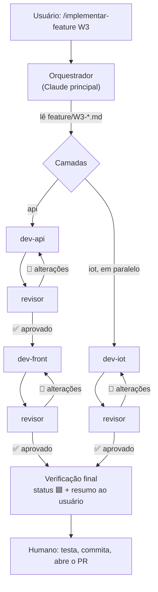

# Dinâmica de geração de código com agentes

O projeto usa **agentes do Claude Code** para acelerar o desenvolvimento sem perder qualidade: um
desenvolvedor especialista para cada área e um revisor que avalia a entrega e pede alterações. Os
agentes ficam versionados em `.claude/agents/` e a orquestração em `.claude/skills/implementar-feature/`.

## Os agentes

| Agente | Arquivo | Área | Pode editar? | Entrega |
|---|---|---|---|---|
| `dev-api` | `.claude/agents/dev-api.md` | `api/` (FastAPI, motor de risco, Open-Meteo, MQTT, SQLite) | sim | Código + testes + relatório |
| `dev-front` | `.claude/agents/dev-front.md` | `front-web/` (Streamlit) | sim | Telas + testes + roteiro de conferência visual |
| `dev-iot` | `.claude/agents/dev-iot.md` | `iot/` (ESP32, PlatformIO, Wokwi) | sim | Firmware compilando + roteiro de teste no Wokwi |
| `dev-dados` | `.claude/agents/dev-dados.md` | dados e modelo (pipelines, banco, treino, métricas) | sim | Dataset, modelo, métricas + relatório |
| `qa-integracao` | `.claude/agents/qa-integracao.md` | testes ponta a ponta e evidências | só testes e evidências | Cenários validados + defeitos |
| `doc-entrega` | `.claude/agents/doc-entrega.md` | documentação e conformidade com o enunciado | só documentação | READMEs, diagrama, checklist |
| `revisor` | `.claude/agents/revisor.md` | todas | **não** (só lê e roda verificações) | Veredito + lista de alterações |

Cada dev só mexe na própria pasta (e na documentação ligada à entrega). Quando precisa de algo de outra
área, ele registra em "Pendências" e o orquestrador aciona o agente certo.

## O ciclo

1. **Preparar:** o orquestrador lê a feature, confere as dependências, cria a branch `feat/<ID>-…` e marca 🟨.
2. **Implementar:** cada dev lê a especificação e os documentos, implementa, roda as verificações e devolve um **relatório padrão**.
3. **Revisar:** o revisor compara a entrega com os critérios de aceite, `regras-de-risco.md`, o contrato MQTT e os padrões. Depois roda lint, testes e build e devolve um **veredito**:
   - ✅ **APROVADO**: zero itens 🔴 (bloqueante) e zero 🟡 (importante);
   - 🔁 **ALTERAÇÕES SOLICITADAS**: lista numerada com `arquivo:linha` e o pedido.
4. **Corrigir:** o **mesmo** agente dev (com o contexto preservado) responde item por item e o revisor faz uma nova rodada. **No máximo 3 rodadas por camada.** Depois disso, a decisão volta para o humano.
5. **Fechar:** verificação final, status 🟦 Em revisão, um resumo com o que o humano precisa testar e uma sugestão de commit e de PR.

## Como usar

- **Feature completa:** `/implementar-feature W3` (ou peça em linguagem natural: "implemente a W3 com os agentes").
- **Só uma área:** "use o `dev-iot` para fazer o E2" e depois "peça ao `revisor` para avaliar o E2".
- **Revisar um trabalho feito à mão:** "use o `revisor` para avaliar a W1 (api)".
- **Validar a integração:** "use o `qa-integracao` para rodar os cenários do I6".
- **Fechar documentação:** "use o `doc-entrega` para atualizar o README e o checklist de entregáveis".

## O papel do humano

Os agentes **não substituem** a revisão humana:
- **Não enxergam a tela.** Confira o front pelo roteiro de "Conferência visual" do relatório.
- **Não rodam o Wokwi.** Siga o "Roteiro de teste no Wokwi" do relatório do `dev-iot`.
- **Não fazem commit nem push.** Você revisa o diff, commita e abre o PR (que passa pela CI e por 1 aprovação).

## Boas práticas

- **Uma feature por vez**, na ordem do cronograma (`feature/README.md`).
- **Um commit ou PR por feature aprovada**, para facilitar voltar atrás.
- Se o revisor apontar um problema na **especificação** (e não no código), corrija primeiro o documento (`feature/` ou `document/`) e depois peça ao dev para ajustar.
- Pedidos "fora do escopo" do revisor viram **issues**, não entram na feature atual.
- Ao mudar as regras de trabalho do projeto, atualize os agentes em `.claude/agents/`. Eles leem o `CLAUDE.md` e a pasta `document/`, então quase sempre basta atualizar esses arquivos.
