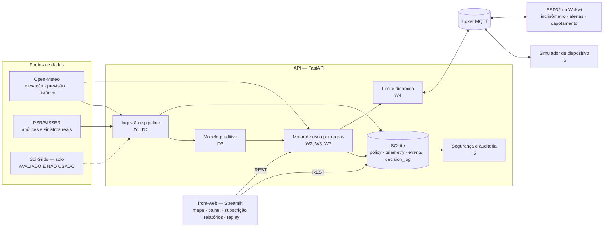
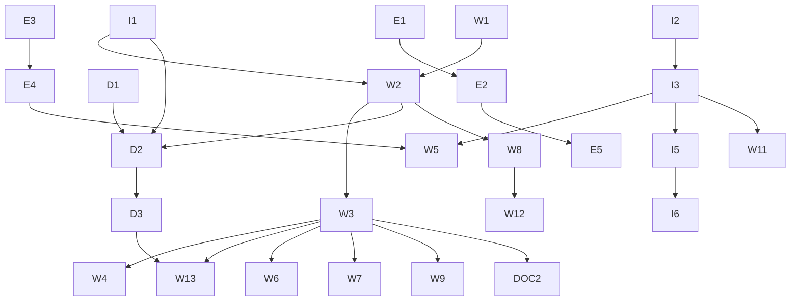

# Plano de implementação — o que será entregue

Documento único com **tudo que será implementado** no Sompo AgriShield até 27/09/2026. Cada item
aponta para a especificação detalhada em [`feature/`](../feature/README.md). Status sempre atualizado
em [feature/README.md](../feature/README.md).

## 1. O que é o produto

Um sistema que **previne acidentes com máquinas agrícolas cruzando relevo com clima**, e que entrega
à seguradora risco objetivo no lugar de questionário.

Quatro entregas de valor:

1. **Mapa de risco por talhão e por dia** — a inclinação de cada pedaço da fazenda cruzada com a previsão do tempo, com o motivo de cada alerta.
2. **Limite de inclinação dinâmico na máquina** — a nuvem calcula o limite seguro do dia e o ESP32 alerta o operador na hora, mesmo sem internet.
3. **Risco objetivo para a seguradora** — perfil de terreno na cotação e probabilidade de sinistro por um modelo treinado com **sinistros reais** do seguro rural.
4. **Rastreabilidade** — toda decisão (score, limite, alerta) fica registrada com entrada, saída e versão de regra e modelo.

## 2. Arquitetura final

## 3. Fluxo de ponta a ponta

**Entrada → banco → modelo → saída**, que é exatamente o que o enunciado pede:

1. **Entrada histórica:** as apólices do PSR são baixadas, limpas, anonimizadas e carregadas no banco (D1).
2. **Enriquecimento:** para uma amostra de propriedades, buscamos relevo e clima do período e montamos o dataset (D2).
3. **Modelo:** treino, avaliação contra o baseline de regras e publicação do artefato com métricas (D3).
4. **Entrada ao vivo:** o ESP32 publica inclinação, temperatura e eventos por MQTT (E1–E6); a ponte da API valida, deduplica e grava (I2, I3).
5. **Processamento:** o motor cruza relevo e clima e gera nível, motivo e limite do dia; o modelo acrescenta a probabilidade (W2, W3, W7, W13).
6. **Saída:** mapa, painel ao vivo, perfil de subscrição, relatórios de tendência, recomendações e o limite enviado de volta à máquina (W1–W13).
7. **Registro:** cada decisão vai para a trilha de auditoria (I5) e cada validação gera evidência (I6).

## 4. Tudo que será implementado

### Infraestrutura (I)

| ID | O que será feito |
|---|---|
| **I1** | Cliente único da Open-Meteo (elevação, previsão, histórico) com timeout, cache com TTL e *stale-if-error*; agregação diária do clima |
| **I2** | Ponte MQTT na API: assina telemetria, eventos e status; valida com Pydantic; deduplica evento; publica o `config` com retained |
| **I3** | SQLite com SQLModel: `telemetry`, `device_event`, `device_status`, `published_config`, `policy`; retenção de 7 dias de telemetria |
| **I4** | Ambiente de demo: `scripts/run-demo.sh`, teste de clone limpo, checklist e plano B |
| **I5** | Chave de API nos endpoints de escrita, log estruturado com `request_id`, tabela `decision_log`, endpoint de auditoria, hash de integridade |
| **I6** | Simulador de dispositivo com 6 cenários e testes `tests/e2e/`, gerando evidências |

### Dados e modelo (D)

| ID | O que será feito |
|---|---|
| **D1** | Download e ingestão do PSR/SISSER (2006–2025): leitura ISO-8859-1, anonimização, normalização do evento, carga no banco, relatório de qualidade |
| **D2** | Dataset de 2.000 a 5.000 apólices com relevo, clima da vigência, solo e contexto, rotulado por indenização |
| **D3** | Treino de regressão logística e floresta aleatória, divisão temporal, AUC-ROC, AUC-PR, recall, precisão, importância das variáveis e artefato versionado |

### Plataforma (W)

| ID | O que será feito |
|---|---|
| **W1** | Três fazendas de demonstração com equipamentos, seletor no front |
| **W2** | Grade 10×10, inclinação, orientação e classes de terreno, mapa e estatísticas |
| **W3** | Risco de 7 dias por célula (capotamento e atolamento), estado do solo, limite do dia, cenários simulados |
| **W4** | Cálculo e publicação do limite dinâmico ao ESP32, com envio manual pelo front |
| **W5** | Painel ao vivo: status, inclinação, gráfico de 10 min, eventos e banner de capotamento |
| **W6** | Recomendações em texto e janelas seguras de operação |
| **W7** | Perigos de raio, vento e incêndio (regra dos 30) |
| **W8** | Perfil de terreno para subscrição, com score, classe A/B/C e visão de carteira |
| **W9** | Replay de acidentes reais noticiados, com veredito honesto |
| **W10** | Alerta de capotamento no Telegram |
| **W11** | Histórico do equipamento (prévia do Passaporte Digital) |
| **W12** | Relatórios e tendências por equipamento, região e cultura, com exportação CSV |
| **W13** | Score híbrido na tela: nível por regras + probabilidade do modelo + fatores que mais pesaram |

### Dispositivo (E)

| ID | O que será feito |
|---|---|
| **E1** | Leitura do MPU6050 a 10 Hz com média móvel, roll, pitch e aceleração |
| **E2** | Três níveis de alerta com LEDs e buzzer, histerese e evento `tilt_alert` |
| **E3** | Recebimento e validação do limite via MQTT, com persistência em NVS |
| **E4** | Telemetria a cada 5 s com NTP, `seq` e envio imediato na mudança de nível |
| **E5** | Detecção de capotamento com buffer de contexto de 30 s e evento reenviado 3 vezes |
| **E6** | DHT22 a cada 2 s e contagem das condições da regra dos 30 |
| **E7** | Display OLED com inclinação, limite e nível |
| **E8** | Botão de ocorrência com contexto dos últimos 30 s |

### Documentação e entrega (DOC) e trilha do time (T)

| ID | O que será feito |
|---|---|
| **DOC1** | User Stories dos 4 perfis e matriz de rastreabilidade |
| **DOC2** | README final, diagrama final, evidências, roteiro e gravação do vídeo, repositório privado com o tutor |
| **T1–T6** | Pesquisa de limiares, casos reais para o replay, estatísticas, pitch, vídeo e validação do circuito |

## 5. Ordem de implementação

Ondas, na ordem em que os agentes são acionados:

| Onda | Features | Agentes |
|---|---|---|
| 1 | I1, W1 · D1 · E1, E2 | dev-api · dev-dados · dev-iot |
| 2 | W2, I3 · D2 · E3, E4 · DOC1 | dev-api, dev-front · dev-dados · dev-iot · doc-entrega |
| 3 | W3, I2 · D3 · E5 | dev-api, dev-front · dev-dados · dev-iot |
| 4 | W4, W5, I5, W12, W13 · E6 · I6 | dev-api, dev-front · dev-iot · qa-integracao |
| 5 | W6, W7, W8, W9 · E7, E8 | dev-api, dev-front · dev-iot |
| 6 | W10, W11, I4 | dev-api, dev-front |
| 7 | DOC2, evidências, vídeo | doc-entrega + time |

## 6. Entregáveis do enunciado × features

| Entregável | Features | Evidência |
|---|---|---|
| Sistema consolidado e reproduzível | I1–I4, W1–W13, E1–E8 | CI verde, `scripts/run-demo.sh` |
| Banco e modelo com métricas | I3, D1, D2, D3 | `document/dados-e-modelo.md` |
| Validação da integração | I6 | `document/evidencias/` |
| Segurança e rastreabilidade | I5 | tabela `decision_log`, testes de 401 |
| Relatórios, alertas e visualização | W3, W5, W8, W12, W13 | prints em `document/evidencias/prints/` |
| Diagrama de arquitetura final | DOC2 | `document/arquitetura.md` |
| Vídeo de até 5 min | DOC2, T5 | link no `README.md` |
| README final | DOC2 | `README.md` |
| Repositório privado com o tutor | DOC2 | Settings → Collaborators |

## 7. O que precisa funcionar no dia (definição de MVP pronto)

- [ ] Subir API e front com um comando e abrir a fazenda de demonstração
- [ ] Mapa de relevo e risco de 7 dias, com motivo em cada área crítica
- [ ] Limite do dia calculado e **recebido pelo ESP32 no Wokwi**, com LED e buzzer reagindo
- [ ] Capotamento simulado gerando evento, banner no painel e registro na auditoria
- [ ] Perfil de subscrição e relatórios de tendência abrindo com dados reais
- [ ] Métricas do modelo publicadas, comparadas com o baseline de regras
- [ ] Replay de pelo menos um acidente real com veredito
- [ ] Evidências de validação e vídeo gravados

## 8. Riscos e planos B

| Risco | Plano B |
|---|---|
| Portal do PSR fora do ar | Amostra versionada em `data/sample/` e banco já carregado |
| Limite de chamadas da Open-Meteo | Cache, amostra menor e agrupamento por município |
| Modelo não superar o baseline | Publicar o resultado honestamente; as regras seguem no comando. **Aconteceu em 20/09 e reverteu em 21/09:** com a D2 fechada em 2.256 linhas e o modelo retreinado, ele passou a superar o baseline no teste de 2024, com três ressalvas declaradas ([dados-e-modelo.md](dados-e-modelo.md#resultados-do-modelo-d3)). O plano B valeu nos dois sentidos — as regras seguem no comando do alerta de qualquer forma ([regras-de-risco.md §11](regras-de-risco.md)) |
| Broker MQTT instável | Trocar para `test.mosquitto.org` |
| Semana seca (sem risco na previsão) | Cenários simulados, sempre rotulados na tela |
| Falta de tempo | A fila de features em `feature/README.md` define quem escorrega. P0 nunca |
