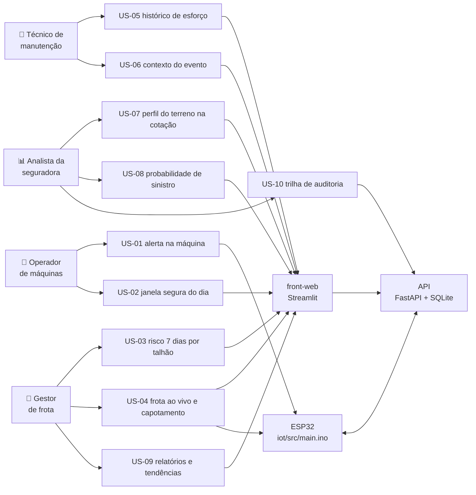

# User Stories e rastreabilidade

Histórias de usuário do Sompo AgriShield, com critérios de aceite verificáveis e a **matriz de
rastreabilidade** que liga cada história às features, aos arquivos e à evidência de teste.

> **Como esta lista foi construída (leia antes de cobrar histórico).**
> O grupo **não tem registro escrito das User Stories das Sprints 1 a 3**. Esta lista foi
> **consolidada agora, na Sprint 4 (19/09/2026)**, a partir do problema que o produto ataca, das
> features já especificadas em [`feature/`](../feature/README.md) e dos quatro perfis citados no
> enunciado do Challenge. Não reconstruímos retroativamente histórias que não existiram: o que está
> aqui é o que o time assume como escopo **desta** entrega. Onde uma história cobre algo que já vinha
> sendo perseguido desde o início (limite dinâmico na máquina e risco objetivo para a seguradora),
> isso está dito no texto da história, sem inventar data nem número de sprint.

## Como ler

**Formato**

> **US-xx** — Como **\<perfil\>**, quero **\<o quê\>**, para **\<por quê\>**.
> **Critérios de aceite:** condições verificáveis (por teste automatizado, por simulação no Wokwi ou
> por print de tela). **Prioridade:** P0 obrigatório · P1 importante · P2 se sobrar tempo.

**Situação** (usada na matriz e no cabeçalho de cada história)

| Símbolo | Significa |
|---|---|
| ⬜ | Não implementado — só especificação |
| ⚠️ | Parcial — parte do caminho existe em código, mas a história **não** entrega valor ponta a ponta |
| ✅ | Pronto **com evidência** (teste automatizado verde, relatório em `document/evidencias/` ou print) |

A prioridade da história segue a prioridade das features que a sustentam
([feature/README.md](../feature/README.md)). Uma história P0 pode ter complementos P1/P2: isso está
marcado feature a feature.

## Mapa: perfis, histórias e onde elas aparecem

---

## Operador de máquinas

Quem está na cabine. Não abre painel no meio da lavoura: precisa de aviso **no equipamento** e de uma
resposta simples antes de sair para o campo.

### US-01 — Alerta de inclinação na própria máquina · ⚠️ parcial

> Como **operador**, quero ser avisado dentro da máquina quando a inclinação passar do limite seguro
> **daquele dia**, para não capotar.

Esta é a história que existe desde o início do projeto: o limite não é fixo de fábrica, ele muda com
a chuva dos últimos dias.

**Critérios de aceite**

1. Com o limite `L` vigente e razão de aviso `w = 0,8`: abaixo de `w·L` o LED verde fica aceso; entre
   `w·L` e `L` o amarelo; em `L` ou acima, o vermelho com buzzer intermitente. (E2)
2. Há histerese de 1°: voltando do vermelho, o nível só cai depois de `L − 1°`; voltando do amarelo,
   só depois de `w·L − 1°`. O LED não pisca em torno do limite. (E2)
3. Mexer no slider do MPU6050 no Wokwi reflete no Serial em ≤ 1 s, e os ângulos de 0°, 10°, 15° e 60°
   são lidos com erro ≤ 0,5°. (E1)
4. A API publica o limite do dia (15 / 12,5 / 10° para solo seco / úmido / encharcado, conforme
   [regras-de-risco.md](regras-de-risco.md) §4) e o ESP32 passa a usá-lo em ≤ 2 s. (W4, E3)
5. Reiniciando a simulação, o dispositivo recebe de novo o último limite publicado (mensagem
   *retained*), sem precisar de nova ação no painel. (W4, E3)
6. **Sem internet o alerta continua funcionando** com o último limite conhecido; sem nenhum limite
   recebido, vale o padrão de 15°. (E2, E3)
7. Cada entrada no vermelho gera **um** evento `tilt_alert` no broker (não um por leitura). (E2)

**Prioridade:** P0 · **Features:** E1, E2, E3, W4 (todas P0); E7 (display, P2) é complemento.

**Situação em 20/09/2026:** critérios 1, 2, 6 e 7 implementados no firmware (E1, E2) e critérios 4
e 5 implementados dos dois lados — a API calcula e publica o limite do dia *retained*
(`services/limits.py`, `POST /devices/{id}/limit/publish`, com botão na tela) e o firmware valida,
aplica e persiste na NVS (E3). **O critério 3 continua sem verificação**: ninguém rodou a simulação
no Wokwi conferindo o erro de leitura (T6), e o tempo de ≤ 2 s do critério 4 também só foi testado
com mock, nunca contra o broker real. Por isso a história fica ⚠️, e não ✅.

### US-02 — Saber em que horas do dia dá para trabalhar na encosta · ✅

> Como **operador**, quero ver em que horas do dia é seguro trabalhar em cada parte da fazenda, para
> organizar o turno sem depender de achismo.

**Critérios de aceite**

1. A tela mostra, para o dia escolhido, as **janelas seguras** em horas (ex.: "06h–11h"). (W6)
2. Nenhuma janela inclui hora com chuva ≥ 0,5 mm, rajada ≥ 45 km/h ou código de tempestade. (W6)
3. Janelas menores que 2 h são descartadas, e só entram horas entre 06h e 18h. (W6)
4. Em um dia sem nenhuma célula 🟡 ou 🔴, a tela mostra apenas "Sem restrições…", em vez de uma lista
   vazia. (W6)
5. Cada recomendação vem com o **motivo em números** (ex.: "72 mm de chuva em 72 h, inclinação 13°"),
   nunca só a cor. (W3)
6. A direção citada na recomendação ("evite as encostas voltadas para o sul") bate com a maioria das
   células vermelhas. (W6)

**Prioridade:** P0 para o risco do dia (W3); P1 para as janelas e frases (W6). · **Features:** W3
(P0), W6 (P1), I1 (P0, pré-requisito de clima).

**Situação em 20/09/2026 (fim do dia): os seis critérios estão atendidos.** A W6 foi entregue.

`GET /api/v1/farms/{id}/recommendations` devolve as janelas seguras de hoje e amanhã, e o card
**O que fazer** as exibe no front. Cada critério tem teste nomeado em
`api/tests/test_recommendations.py`:

- **1 e 3** — janela em horas, mínimo de 2 h e só entre 06h e 18h
  (`test_a_calm_day_is_one_window_from_six_to_eighteen`,
  `test_a_window_shorter_than_two_hours_is_discarded`, `test_a_two_hour_window_is_kept`,
  `test_windows_never_leave_the_working_hours`).
- **2** — chuva, rajada e tempestade quebram a janela
  (`test_rain_splits_the_day_in_two_windows`, `test_a_stormy_afternoon_has_no_window_after_it_starts`).
- **4** — dia sem restrição diz isso, em vez de lista vazia
  (`test_a_green_day_says_there_are_no_restrictions`).
- **5** — motivo com número em cada célula 🟡/🔴 (W3, já valia antes).
- **6** — a direção citada sai das células **vermelhas**, não de todas
  (`test_the_rollover_message_names_the_dominant_slope_direction`,
  `test_only_the_red_cells_decide_the_direction`).

Vale registrar o cuidado que a W6 tomou e que não estava nos critérios: uma janela segura **não
libera as áreas vermelhas**, e a tela avisa isso num dia com célula 🔴
(`test_a_red_day_warns_that_the_window_does_not_free_the_red_areas`). Sem esse aviso, "pode
trabalhar das 6 às 11" seria lido como permissão geral.

---

## Gestor de frota

Decide onde cada máquina trabalha na semana e responde quando algo acontece.

### US-03 — Ver onde estão os riscos nos próximos 7 dias · ⚠️ parcial

> Como **gestor**, quero ver quais áreas da fazenda ficam em risco nos próximos 7 dias, para
> remanejar máquinas e serviços antes de a chuva chegar.

**Critérios de aceite**

1. O mapa mostra a fazenda dividida em células, com inclinação, orientação e classe de terreno
   (baixada, encosta, topo exposto) calculadas a partir da elevação. (W2)
2. Há 7 cards, um por dia, cada um com o **pior nível** daquele dia, e esse nível bate com o pior
   nível das células do mesmo dia. (W3)
3. Em um dia com chuva acumulada de 72 h ≥ 30 mm, as células com inclinação ≥ 10° aparecem em
   vermelho. (W3)
4. Toda célula 🟡 ou 🔴 exibe pelo menos um motivo com número. (W3)
5. Perigos de tempestade, rajada e calor aparecem separados: tempestade deixa as células `exposed`
   em 🔴; rajada de 60 km/h deixa `exposed` 🔴 e as demais 🟡. (W7)
6. Com a Open-Meteo fora do ar e sem cache, a tela mostra "Serviço de clima indisponível"
   (HTTP 503) — não uma tela quebrada. (W2, I1)
7. A resposta do mapa sai em menos de 3 s sem cache e menos de 200 ms com cache. (W2)

**Prioridade:** P0 · **Features:** W1, W2, W3 (P0), W7 (P1), I1 (P0).

**Situação em 20/09/2026 (fim do dia): seis critérios atendidos; o sétimo continua sem medição.**

- **Critérios 1, 2, 3, 4 e 6 — ✅**, cobertos por teste: a aba **Relevo** desenha a grade 10×10 com
  inclinação, orientação e classe; a aba **Previsão de risco** traz os 7 cards, o mapa por nível e
  o motivo com número; a Open-Meteo fora do ar devolve 503 e a tela mostra a mensagem.
- **Critério 5 — ✅.** A W7 foi entregue: o motor avalia **cinco perigos** por célula
  (capotamento, atolamento, raio, vento e incêndio pela regra dos 30), com os motivos empilhados
  quando mais de um dispara (`test_a_storm_day_stacks_the_reasons_of_several_hazards`,
  `test_wind_boundaries`, `test_fire_boundaries`, `test_fire_message_explains_the_slope_escalation`).
  No front, o filtro de perigos tem ícone para raio, vento e incêndio.
- **Critério 7 — ⚠️ continua em aberto.** É de desempenho e **nunca foi medido**: não há teste de
  tempo de resposta para o mapa (3 s sem cache, 200 ms com cache). O que existe de medição de
  tempo é da integração MQTT (I6), que é outra coisa. **Não confunda os dois na hora de
  apresentar.**

### US-04 — Acompanhar os equipamentos ao vivo e ser avisado de capotamento · ⚠️ parcial

> Como **gestor**, quero ver o estado dos equipamentos em tempo real e receber alerta imediato de
> capotamento, para socorrer o operador e acionar a seguradora na hora.

**Critérios de aceite**

1. O painel mostra, por equipamento: online/offline, inclinação atual, nível e limite vigente. (W5)
2. Mexer no slider do MPU6050 muda o nível no painel em ≤ 3 s, e o gráfico em ≤ 7 s (telemetria a
   cada 5 s). (W5, E4)
3. Parando a simulação, o painel indica **Offline** em ≤ 30 s (via status *last will*). (W5)
4. Um capotamento (inclinação ≥ 60° por 3 s, ou aceleração ≥ 2,5 g) gera evento com os 30 s de
   contexto anteriores; inclinação de 50° por 1 s **não** dispara. (E5)
5. O mesmo evento enviado 3 vezes é gravado **uma única vez** no banco. (I2, I3, E5)
6. Sem dados do equipamento, a página mostra "Aguardando o equipamento conectar…", não um erro. (W5)
7. O alerta de capotamento chega ao Telegram em ≤ 5 s, uma vez por evento. (W10, P2 — pode ficar de
   fora sem invalidar a história)

**Prioridade:** P0 (painel ao vivo); P1 para a detecção de capotamento (E5); P2 para o Telegram
(W10). · **Features:** W5, I2, I3, E4 (P0), E5 (P1), W10 (P2).

**Situação em 20/09/2026:** critérios 1, 4, 5 e 6 implementados e testados: o painel mostra
status/nível/limite (W5), o firmware detecta capotamento por inclinação sustentada ou impacto e manda
30 s de contexto (E5), a ponte MQTT deduplica as 3 cópias do mesmo `event_id` (I2/I3, teste em
`api/tests/test_mqtt_bridge.py`) e a página sem telemetria diz "Aguardando…" em vez de erro
(`test_device_without_telemetry_is_waiting_not_an_error`). Os **critérios 2 e 3 (tempo real) foram medidos com o
broker de verdade na I6**: o nível novo fica disponível para o painel 0,392 s depois de a
inclinação mudar e o ponto entra no gráfico em 0,408 s — mais até 2 s de recarga do front, dentro
dos 3 s e 7 s ([evidência](evidencias/2026-09-20-integracao-ponta-a-ponta.md)). Falta só a
conferência visual na tela, com o Wokwi. O critério 7 (Telegram, W10, P2) não começou.

### US-09 — Relatórios e tendências para planejar a safra · ✅

> Como **gestor**, quero relatórios de tendência por equipamento, região e cultura, para justificar
> investimento e mudar a escala de trabalho com base em dado, não em impressão.

**Critérios de aceite**

1. Existem três relatórios — equipamento, região e cultura — e cada um diz, em uma linha, **para quem
   serve** e **que decisão apoia**. (W12)
2. Cada relatório abre com dados reais carregados (PSR) ou telemetria gravada, não com dado
   inventado. (W12, D1, I3)
3. Um período sem dados mostra mensagem clara, não erro. (W12)
4. O CSV exportado abre no Excel com acentos corretos (UTF-8 com BOM) e vírgula decimal. (W12)

**Prioridade:** P1 · **Features:** W12 (P1), I3 (P0), D1 (P0).

**Situação em 20/09/2026 (fim do dia): os quatro critérios estão atendidos.** A W12 foi entregue e
aprovada.

- **Critério 1** — `GET /api/v1/reports/equipment/{id}`, `/region` e `/crop`, cada um com um campo
  `purpose` dizendo para quem serve, exibido na tela (`front-web/views/reports.py`, abas
  🚜 Equipamento · 🗺️ Região · 🌾 Cultura).
- **Critério 2** — região e cultura são calculados sobre as **1.525.473 apólices reais** do PSR na
  tabela `policy` (D1); equipamento, sobre a telemetria e os eventos gravados pela I3. Nenhum dado
  inventado.
- **Critério 3** — período sem dados vira aviso, não erro
  (`test_a_period_without_data_is_not_an_error`, `test_an_empty_csv_explains_itself`; no front,
  `test_region_report_without_data_warns_instead_of_failing`).
- **Critério 4** — CSV com **BOM UTF-8**, separador `;` e vírgula decimal, justamente para o Excel
  em pt-BR (`test_the_region_csv_opens_in_excel`, `test_the_csv_keeps_the_accents`).

**Onde a história encosta no enunciado:** ele pede tendências por equipamento, **região** e
**operação**. A nossa terceira dimensão é a **cultura**, que é o recorte de operação que a base
real do PSR sustenta — dizer "operação" e entregar "cultura" sem explicar seria maquiagem.

**Falta:** os **prints** das três abas (item 10 da
[lista de prints](evidencias/prints/README.md)).

---

## Técnico de manutenção

Olha para a máquina depois do turno: quanto ela sofreu e por quê.

### US-05 — Histórico de esforço e de eventos da máquina · ⚠️ parcial

> Como **técnico**, quero ver quanto tempo a máquina operou e quantas vezes passou do limite, para
> priorizar a manutenção de quem sofreu mais.

**Critérios de aceite**

1. A página mostra, por equipamento e por período: tempo operando, inclinação máxima, número de
   alertas 🟡/🔴 e número de capotamentos. (W11)
2. Os números batem com os dados gravados no banco — verificado por teste com dados sintéticos. (W11)
3. Sem dados no período, aparece mensagem amigável, não erro nem gráfico vazio sem explicação. (W11)
4. O relatório por equipamento mostra a tendência ao longo do tempo (gráfico de linha) e permite
   exportar CSV. (W12)

**Prioridade:** P1 para a tendência (W12); P2 para o histórico completo (W11). · **Features:** W11
(P2), W12 (P1), I3 (P0).

**Situação em 20/09/2026 (fim do dia): parcial — o critério 4 saiu, os três primeiros não.**

- **Critério 4 (W12, P1) — ✅.** O relatório por equipamento existe, mostra a tendência ao longo do
  tempo e exporta CSV: `GET /api/v1/reports/equipment/{device_id}` (+ `.csv`) e a aba
  🚜 Equipamento em `front-web/views/reports.py`. Testes na API (`test_reports.py`) e no front
  (`test_equipment_report_shows_kpis_and_trend`,
  `test_equipment_report_without_telemetry_is_not_an_error`).
- **Critérios 1, 2 e 3 (W11, P2) — ⬜.** A W11 (histórico completo do equipamento, prévia do
  Passaporte Digital) **não começou**, e é P2. A telemetria e os eventos já ficam gravados no
  SQLite (I3), então o que falta é agregar e exibir, não coletar.

A história entrega valor parcial hoje: o técnico já consegue ver a tendência e exportar, mas não
o histórico consolidado de esforço por máquina.

### US-06 — Ver as condições no momento de cada evento · ⚠️ parcial

> Como **técnico**, quero ver inclinação, aceleração, temperatura e umidade nos segundos em torno de
> cada evento, para investigar a causa em vez de adivinhar.

**Critérios de aceite**

1. Cada evento de capotamento guarda **30 linhas de contexto** (os 30 s anteriores) e elas aparecem
   no painel. (E5, W5)
2. A telemetria chega a cada 5 s (±0,5 s) com inclinação, aceleração, nível e limite vigente, e uma
   mudança de nível gera uma telemetria extra imediata. (E4)
3. Temperatura e umidade do DHT22 aparecem junto ao evento; quando a leitura falha, o campo vem
   `null` em vez de um número errado. (E6)
4. A "regra dos 30" (temperatura ≥ 30 °C, umidade ≤ 30%, vento ≥ 30 km/h) é contabilizada e exibida:
   35 °C + 20% de umidade + 35 km/h de vento → `fire_conditions = 3`. (E6)
5. Uma ocorrência marcada pelo operador com o botão aparece na lista de eventos do painel. (E8, P2)
6. Os valores mostrados são **idênticos** aos publicados pelo dispositivo, comparados campo a campo
   na validação de integração. (I6)

**Prioridade:** P1 · **Features:** E4 (P0), E5, E6 (P1), E8 (P2), W5 (P0), I2, I3 (P0), I6 (P0).

**Situação em 20/09/2026:** critérios 1, 3, 4 e 5 implementados — o firmware publica telemetria a
cada 5 s (E4), guarda 30 s de contexto no `rollover` (E5), publica temperatura/umidade com `null` na
falha do DHT22 e conta a regra dos 30 (E6), e o botão de ocorrência gera evento (E8); o painel mostra
os eventos e o gráfico de contexto (W5). O **critério 6 está atendido do dispositivo até a API**:
a I6 compara campo a campo o que foi publicado com o que está no banco e com o que os endpoints
devolvem, em 100 mensagens de rajada e nos demais cenários, sem uma diferença
([evidência](evidencias/2026-09-20-integracao-ponta-a-ponta.md)). O último trecho — API → tela —
continua sendo conferência visual.

---

## Analista da seguradora

Precifica no início e decide no sinistro. Quer número defensável, não questionário.

### US-07 — Perfil de risco do terreno já na cotação · ✅

> Como **analista**, quero um perfil objetivo do terreno da propriedade no momento da cotação, sem
> depender de questionário nem de visita, para precificar melhor.

**Critérios de aceite**

1. Informada a propriedade, o sistema devolve: % da área com inclinação > 15°, % entre 8 e 15°, % de
   baixada, % de área exposta, um `terrain_score` de 0 a 100 e uma classe A/B/C. (W8)
2. O cálculo é determinístico e tem teste: 23% > 15°, 40% entre 8 e 15°, 8% de baixada e 15% exposta
   → score **48,5**, classe **B**. (W8)
3. O score fica sempre entre 0 e 100, em qualquer entrada. (W8)
4. A fazenda plana de demonstração tira classe A; a de café em relevo acidentado tira B ou C. (W8, W1)
5. A tela lista os **drivers** do score (o que puxou o risco para cima), não só o número final. (W8)

**Prioridade:** P1 (depende de W2, que é P0) · **Features:** W2 (P0), W8 (P1), W1 (P0).

**Situação em 20/09/2026 (fim do dia): os cinco critérios estão atendidos.** A W8 foi entregue e
aprovada.

- **Critério 1** — `GET /api/v1/farms/{id}/underwriting` devolve os quatro percentuais do relevo,
  o `terrain_score` de 0 a 100 e a classe A/B/C (`api/app/services/underwriting.py`).
- **Critério 2** — o teste do caso exato existe e passa: 23% acima de 15°, 40% entre 8 e 15°, 8%
  de baixada e 15% exposta → **48,5**, classe **B**, com a conta aberta no próprio teste
  (`api/tests/test_underwriting.py`).
- **Critério 3** — há teste de faixa garantindo `0 ≤ score ≤ 100` em qualquer entrada.
- **Critério 4** — a fazenda plana tira **A** e a de café em relevo acidentado tira **B ou C**,
  ambos verificados em teste.
- **Critério 5** — a tela lista os **drivers** do score, não só o número
  (`front-web/views/underwriting.py`; `test_underwriting_shows_class_score_and_drivers`,
  `test_underwriting_flat_farm_has_no_penalising_driver`).

A tela ainda exibe, aberta e sem expander, a **nota de calibração** com a versão dos pesos: os
pesos do score são uma escolha do projeto, não um número calibrado contra sinistro de máquina, e
isso precisa estar à vista de quem for precificar
(`test_underwriting_shows_the_calibration_note_in_the_open`).

**Falta:** o **print** da tela (item 9 da [lista de prints](evidencias/prints/README.md)).

### US-08 — Probabilidade de sinistro com dados reais e contexto do evento · ⚠️ parcial

> Como **analista**, quero a probabilidade de sinistro calculada sobre dados históricos reais e o
> contexto objetivo do evento, para decidir aceitação e conduzir a regulação do sinistro.

**Critérios de aceite**

1. A base de treino vem de **dados públicos reais** do seguro rural (PSR/SISSER), com relatório de
   qualidade que mostra as contagens de descarte por motivo — nada de descarte silencioso. (D1)
2. Nenhum nome ou documento de pessoa chega ao banco; há teste automático que falha se aparecer. (D1)
3. O dataset tem ≥ 2.000 linhas, com a taxa de sinistro real preservada e o desbalanceamento
   declarado; nenhuma feature usa informação posterior ao fim da vigência. (D2)
4. O treino imprime **baseline de regras × modelo** na mesma tabela, e as métricas publicadas são
   exatamente as geradas pelo script (nenhum número escrito à mão). (D3)
5. Sem o arquivo do modelo, a API sobe assim mesmo e responde só com as regras, avisando no log. (D3)
6. A tela mostra as duas leituras sem confundir: **nível** (regras, explicável) e **probabilidade**
   (modelo), com os 3 fatores de maior peso. (W13)
7. As limitações estão escritas no documento: o rótulo é de seguro agrícola (não de máquina), há viés
   de quem contrata seguro e a amostra é limitada. (D3,
   [dados-e-modelo.md](dados-e-modelo.md))
8. No replay, o sistema roda na data e no local de acidentes reais noticiados e diz, com honestidade,
   se teria alertado — informando sempre a precisão da localização. (W9)

**Prioridade:** P0 (D1, D2, D3); P1 para a exibição do score híbrido (W13) e o replay (W9). ·
**Features:** D1, D2, D3 (P0), W13, W9 (P1).

**Situação em 20/09/2026 (fim do dia): sete dos oito critérios atendidos.** D3, W13 e W9 foram
entregues no dia.

- **Critérios 1 e 2 — ✅.** **1.525.473 apólices reais** do PSR/SISSER na tabela `policy`, com
  relatório de qualidade por motivo de descarte, e teste que falha se qualquer coluna pessoal
  chegar ao banco (`test_colunas_pessoais_nunca_chegam_ao_banco`).
- **Critério 3 — ⚠️ o único em aberto.** O dataset tem **menos de 2.000 linhas**: a geração parou
  na **cota diária da Open-Meteo**, não por falta de código. A taxa de sinistro real foi
  preservada na amostragem e o desbalanceamento está declarado; o teste de não vazamento
  climático existe. O número exato e a explicação de qual API acabou primeiro estão em
  [dados-e-modelo.md](dados-e-modelo.md#dataset-de-treino-d2) e na ficha
  `data/dataset_treino.json`. Retomar **não** exige refazer nada.
- **Critério 4 — ✅.** `scripts/train_model.py` imprime **baseline de regras × modelo na mesma
  tabela**, e as métricas publicadas são exatamente as que o script gerou: há teste garantindo
  que os metadados do artefato contêm precisamente as métricas do treino
  (`test_metadados_tem_exatamente_as_metricas_do_treino`) e outro que verifica que o próprio
  treino reporta se superou ou não o baseline (`test_train_reporta_se_supera_o_baseline`).
  **Nenhum número escrito à mão.**
- **Critério 5 — ✅, e agora de verdade.** Antes era verdadeiro por vacuidade (não havia carga de
  modelo). Hoje existe carga, e existe teste: sem arquivo, `load_model` devolve `None` **com
  aviso no log** (`test_load_model_sem_arquivo_devolve_none_com_aviso`); com arquivo corrompido,
  idem; e a resposta da API continua de pé com os campos do modelo em `null`
  (`test_without_an_artifact_everything_is_null`, `test_a_broken_model_does_not_break_the_response`).
- **Critério 6 — ✅.** O cartão do front mostra as duas leituras sem confundir: nível por regras em
  destaque, probabilidade como cartão secundário, com os 3 fatores de maior peso rotulados como
  importância **global** (não explicação daquele dia). Há teste garantindo que o modelo **nunca**
  altera nível, limite ou motivos (`test_the_model_never_changes_the_level_or_the_limit`,
  `test_the_reasons_never_mention_the_model`).
- **Critério 7 — ✅.** Limitações escritas em [dados-e-modelo.md](dados-e-modelo.md).
- **Critério 8 — ✅.** O replay roda sobre **5 acidentes reais noticiados**, com link da fonte, e
  informa sempre a precisão da localização (todos em `municipio`, porque nenhuma notícia trouxe
  coordenada). O veredito sai em duas leituras — no ponto e na grade de vizinhança.

> **O resultado do modelo, dito como é:** ele **não superou o baseline por regras** no conjunto de
> teste, e o bootstrap pareado mostra que os dois são indistinguíveis com esta amostra — não seria
> possível demonstrar superioridade nem se ela existisse. A frase que aparece na tela é montada
> **a partir do artefato**, em tempo de execução, e há teste que exige que ela diga isso
> (`test_the_note_says_the_model_did_not_beat_the_rules`) e outro que prova que um retreino muda o
> bloco **sem tocar no código**
> (`test_a_retrained_model_changes_the_block_without_touching_the_code`). É por isso que este
> documento não repete a métrica: o número tem uma fonte só, e é o artefato.
>
> **Sobre `MODEL_VERSION = None` em `api/app/core/versions.py`:** não é sinal de modelo ausente.
> É a versão usada quando a decisão foi tomada **sem** modelo. A versão real viaja com a decisão,
> lida do artefato — e há teste de que ela chega à trilha de auditoria
> (`test_the_model_version_reaches_the_audit_trail`).

### US-10 — Trilha de auditoria de cada decisão · ✅

> Como **analista**, quero conseguir reconstruir por que o sistema deu determinado score ou limite em
> determinado dia, para sustentar a decisão diante do segurado e do regulador.

**Critérios de aceite**

1. Cada cálculo de risco, publicação de limite e replay grava uma linha em `decision_log` com
   entrada, saída e as **versões** de regra e de modelo usadas. (I5)
2. Endpoints de escrita exigem chave de API: sem chave → 401; com chave válida → 200. (I5)
3. Toda resposta traz `X-Request-ID`, e o mesmo id aparece na linha de log daquela requisição. (I5)
4. Teste automático garante que nenhuma chave, nome ou documento aparece no log. (I5, D1)
5. `GET /api/v1/audit` exige chave e devolve os registros mais recentes primeiro. (I5)

**Prioridade:** P0 (é o entregável 4 do enunciado) · **Features:** I5 (P0), I3 (P0).

**Situação em 20/09/2026: pronta, com evidência.** Os cinco critérios têm teste automatizado
(`api/tests/test_security.py`, 14 · `test_audit.py`, 15 · `test_logging.py`, 14): `decision_log`
grava entrada, saída e `rules_version` de cada risco, limite e alerta; publicar sem chave devolve
401; `X-Request-ID` sai em toda resposta e aparece na linha de log; há teste de que a chave nunca vai
para o log (`test_the_api_key_never_reaches_the_log`, `test_the_trail_never_carries_the_api_key`); e
`GET /api/v1/audit` exige chave e devolve do mais recente para o mais antigo.
**As duas ressalvas anteriores caíram em 20/09.** O critério 1 está agora atendido por inteiro:

- **A versão do modelo chega à trilha.** Com a D3 treinada e a W13 integrada, a decisão de score
  de risco grava `rules_version` **e** `model_version`, lida do artefato
  (`test_the_model_version_reaches_the_audit_trail`). As decisões que não usam modelo — limite e
  alerta — seguem com `model_version` em `null`, e isso é o correto: a coluna diz *com o que
  aquela decisão foi tomada*, não *o que existe no projeto*. Quando o artefato está ilegível, a
  trilha fica sem versão de modelo em vez de inventar uma
  (`test_an_unreadable_pipeline_leaves_the_audit_without_a_model_version`).
- **O replay existe e é registrado.** A W9 saiu, e cada replay grava sua linha na trilha.

**Falta:** o **print** da consulta de auditoria (item 8 da
[lista de prints](evidencias/prints/README.md)).

---

## Matriz de rastreabilidade

Situação: ⬜ não implementado · ⚠️ parcial · ✅ pronto com evidência.
Arquivos em *itálico* ainda **não existem** — são o caminho previsto pela feature.
Detalhe de cada ID em [feature/README.md](../feature/README.md).

> **Conferida em 20/09/2026**, fim do dia, contra o código, arquivo por arquivo — depois das
> entregas de W6, W7, W8, W9, W12, W13 e D3.
>
> **Contagens de teste foram retiradas desta matriz de propósito.** Elas envelheciam a cada
> entrega e davam a impressão de precisão que não se sustentava um dia depois. O que fica é o
> **nome do arquivo e do teste**, que é o que permite conferir. Para o total, rode
> `uv run pytest --collect-only` no fechamento e anote a data.
>
> O código congela em 25/09 — refaça esta conferência no fechamento.

| História | Perfil | Prio | Features | Arquivos (existentes / *previstos*) | Evidência | Situação |
|---|---|---|---|---|---|---|
| US-01 | Operador | P0 | E1, E2, E3, W4, E7 (todas feitas) | `iot/src/main.ino` · `api/app/services/limits.py` · `api/app/api/v1/routes/devices.py` · `front-web/views/equipment.py` | `api/tests/test_limits.py`, `test_devices_limit_route.py`, `test_limit_publisher.py`, `test_periodic_publisher.py`; front: `test_limit_card_shows_the_day_limit_and_the_dry_soil_reference`, `test_publish_button_sends_the_limit_and_records_the_last_send`. Firmware: compila com `pio run`, **sem captura do Wokwi** (T6 pendente) | ⚠️ |
| US-02 | Operador | P0 | W3, I1, W6 (todas feitas) | `api/app/services/risk.py`, `recommendations.py` · `api/app/api/v1/routes/farms.py` · `front-web/views/risk_map.py` | `api/tests/test_risk_rules.py`, `test_risk_route.py`, `test_recommendations.py` (janelas, mínimo de 2 h, 06–18h, dia sem restrição, direção pelas células vermelhas); front: `test_risk_tab_shows_day_strip_panel_and_chart` | ✅ |
| US-03 | Gestor | P0 | W1, W2, W3, I1, W7 (todas feitas) | `api/app/data/farms.json` · `app/services/farms.py`, `terrain.py`, `weather.py`, `risk.py` · `front-web/views/risk_map.py`, `components/cell_map.py` | `api/tests/test_farms.py`, `test_terrain.py`, `test_terrain_route.py`, `test_risk_rules.py` (5 perigos), `test_risk_route.py`, `test_open_meteo_client.py`; front: testes de mapa e previsão em `test_pages.py`. **Desempenho (critério 7) continua não medido** | ⚠️ |
| US-04 | Gestor | P0 | W5, I2, I3, E4, E5, I6 (feitas); **W10 (P2, não começou)** | `iot/src/main.ino` · `api/app/mqtt/bridge.py`, `handlers.py` · `app/models.py`, `app/db.py` · `app/repositories/devices.py` · `front-web/views/equipment.py` | `api/tests/test_mqtt_bridge.py`, `test_repositories.py`, `test_devices_telemetry_routes.py`, `test_app_lifespan.py`; front: `test_live_panel_shows_status_banner_metrics_and_events`, `test_recent_rollover_pins_the_alert_with_the_context_chart`; **ponta a ponta com broker real:** `api/tests/e2e/` | ⚠️ |
| US-05 | Técnico | P1 | W12 (feita); **W11 (P2, não começou)**; I3 (feita) | `api/app/services/reports.py` · `front-web/views/reports.py` · *`api/app/services/history.py`* | W12: `api/tests/test_reports.py`; front: `test_equipment_report_shows_kpis_and_trend`, `test_equipment_report_without_telemetry_is_not_an_error`. W11: nenhuma | ⚠️ |
| US-06 | Técnico | P1 | E4, E5, E6, E8, W5, I2, I3, I6 (feitas) | `iot/src/main.ino` (`readEnv`, contexto de 30 s, botão) · `api/app/schemas/mqtt.py` · `front-web/views/equipment.py` | `api/tests/test_mqtt_bridge.py`; **campo a campo dispositivo × API:** `api/tests/e2e/` + [evidência](evidencias/2026-09-20-integracao-ponta-a-ponta.md). Falta só a conferência visual API × tela | ⚠️ |
| US-07 | Analista | P1 | W2, W8 (feitas) | `api/app/services/terrain.py`, `underwriting.py` · `api/app/api/v1/routes/farms.py` · `front-web/views/underwriting.py` | `api/tests/test_terrain.py`, `test_underwriting.py` (caso 23/40/8/15 → 48,5 classe B; faixa 0–100; plana = A, café = B/C); front: `test_underwriting_shows_class_score_and_drivers`, `test_underwriting_shows_the_calibration_note_in_the_open`, `test_underwriting_portfolio_is_sorted_by_score`. **Falta o print** | ✅ |
| US-08 | Analista | P0 | D1, D3, W13, W9 (feitas); D2 (dataset parcial — cota da Open-Meteo) | `scripts/download_psr.py`, `build_psr_sample.py`, `load_psr.py`, `build_dataset.py`, `train_model.py` · `api/app/services/psr_ingest.py`, `dataset.py`, `model.py`, `model_scoring.py`, `replay.py` · `api/app/data/model/risk_model_v1.joblib` + `.json` · `data/sample/psr_amostra.csv`, `data/dataset_treino.parquet` | D1: `test_psr_ingest.py`, incl. `test_colunas_pessoais_nunca_chegam_ao_banco`; 1.525.473 linhas em `policy`. D2: `test_dataset.py`, incl. não vazamento — **dataset abaixo das 2.000 linhas do critério 3**. D3: `test_model.py` (baseline × modelo, metadados = métricas do treino, fallback sem artefato). W13: `test_model_scoring.py`, incl. `test_the_note_says_the_model_did_not_beat_the_rules`. W9: `test_replay.py`, `test_replay_cases.py` | ⚠️ |
| US-09 | Gestor | P1 | W12 (feita); I3, D1 (feitas) | `api/app/services/reports.py` · `api/app/api/v1/routes/reports.py` · `front-web/views/reports.py` | `api/tests/test_reports.py` (três recortes, CSV com BOM e vírgula decimal, período vazio não é erro); front: `test_reports_show_the_purpose_of_each_report`, `test_region_report_shows_real_psr_numbers`, `test_crop_report_shows_rate_and_top_event`. **Falta o print** | ✅ |
| US-10 | Analista | P0 | I5, I3, W13, W9 (feitas) | `api/app/core/security.py`, `logging.py`, `versions.py` · `app/repositories/audit.py` · `app/api/v1/routes/audit.py` · `app/models.py` (`decision_log`, `event_integrity`) | `test_security.py`, `test_audit.py`, `test_logging.py`, `test_versions.py` — cobrem os 5 critérios; `test_model_scoring.py::test_the_model_version_reaches_the_audit_trail` fecha o critério 1. **Falta o print** | ✅ |

### Detalhe do que hoje conta como evidência

| Item | Evidência real | Onde |
|---|---|---|
| Clima, relevo e risco (I1, W1, W2, W3, W7) | Testes de serviço e de rota passando offline, com fixtures de respostas reais da Open-Meteo; cinco perigos por célula, cada um com limiar testado nas bordas | `api/tests/` (`test_open_meteo_client.py`, `test_weather_aggregation.py`, `test_ttl_cache.py`, `test_farms.py`, `test_terrain*.py`, `test_risk_*.py`), fixtures em `api/tests/fixtures/` |
| Recomendações e janelas seguras (W6) | Janela mínima de 2 h, limite de 06–18h, dia sem restrição com texto próprio, direção tirada só das células vermelhas, aviso de que a janela não libera área vermelha | `api/tests/test_recommendations.py` |
| Integração MQTT e banco (I2, I3, W4, W5) | Validação de payload, deduplicação por `event_id`, retenção de 7 dias, API sobe sem broker, publicação retained | `api/tests/test_mqtt_bridge.py`, `test_repositories.py`, `test_devices_*.py`, `test_limit_publisher.py`, `test_periodic_publisher.py`, `test_app_lifespan.py` |
| Segurança e rastreabilidade (I5) | 401 sem chave, chave mascarada no log, `X-Request-ID` ponta a ponta, `decision_log` com versão de regra e de modelo, hash do payload cru | `api/tests/test_security.py`, `test_audit.py`, `test_logging.py`, `test_versions.py` |
| Dados reais (D1, D2) | Teste que falha se coluna pessoal chegar ao banco; teste de não vazamento climático; 1.525.473 linhas carregadas em `policy` | `api/tests/test_psr_ingest.py`, `test_dataset.py`, `data/README.md` |
| Modelo e score híbrido (D3, W13) | Artefato treinado e versionado; metadados contêm exatamente as métricas do treino; sem artefato ou com artefato corrompido a API responde só com regras; o modelo **nunca** altera nível, limite ou motivos; a ressalva de que ele **não superou o baseline** é montada a partir do artefato e há teste exigindo que ela diga isso | `api/app/data/model/risk_model_v1.joblib` + `.json`, `api/tests/test_model.py`, `test_model_scoring.py`, [dados-e-modelo.md](dados-e-modelo.md#resultados-do-modelo-d3) |
| Replay de acidentes reais (W9) | 5 casos noticiados com link da fonte e precisão de localização declarada; veredito no ponto e na grade; dois placares obtidos de forma independente e comparados | `api/app/data/replay_cases.json`, `api/tests/test_replay.py`, `test_replay_cases.py`, [evidencias/replay-w9-comparacao-placares.md](evidencias/replay-w9-comparacao-placares.md) |
| Subscrição e relatórios (W8, W12) | Score determinístico com o caso de aceite conferido na unha; CSV que abre no Excel em pt-BR; período sem dados vira aviso, não erro | `api/tests/test_underwriting.py`, `test_reports.py` |
| Telas (as seis) | Testes de front com a API mockada, incluindo "API fora do ar mostra erro, não traceback", "o front não chama a Open-Meteo" e "o relatório nunca vaza `proposal_id`" | `front-web/tests/test_pages.py`, `test_api_client.py` |
| Firmware E1–E8 | Compila com `pio run` (SUCCESS em 20/09); lógica de nível, histerese, capotamento e contexto no código | `iot/src/main.ino` |
| Conferência dos ângulos no Wokwi (E1, critério de erro ≤ 0,5°) | **Não existe** — depende da tarefa T6 do time | — |
| Validação ponta a ponta com broker (I6) | Testes `e2e` em 20/09/2026 (marca `e2e`, fora da CI) com API, broker e simulador de verdade: 100/100 na rajada, payload inválido descartado, capotamento gravado uma vez com contexto e auditoria, LWT e reconexão, tempos da W4 e da W5 medidos | `api/tests/e2e/`, `scripts/simulate_device.py`, [evidencias/2026-09-20-integracao-ponta-a-ponta.md](evidencias/2026-09-20-integracao-ponta-a-ponta.md) |
| Desempenho do mapa (US-03, critério 7) | **Não medido.** Não confundir com os tempos da I6, que são da integração MQTT | — |
| Fontes dos limiares de risco (T1) | **Não existem.** Os limiares de [regras-de-risco.md](regras-de-risco.md) são valores iniciais da v1, declarados como tal, ainda sem referência publicada | [regras-de-risco.md](regras-de-risco.md#fontes-dos-limiares-t1) |
| Prints de tela | **Não existem.** A pasta e a lista do que capturar existem; nenhuma imagem foi tirada | [evidencias/prints/README.md](evidencias/prints/README.md) |

## Cobertura: features sem história e histórias sem feature

- **Toda história aponta para pelo menos uma feature existente em `feature/`.** Não há história órfã.
- Features de **infraestrutura de entrega** não têm história própria porque não são pedidas por um
  perfil de usuário, e sim pelo enunciado: **I4** (ambiente de demo), **I6** (simulador e testes
  ponta a ponta), **DOC1** (este documento) e **DOC2** (entrega final). I6 aparece como evidência das
  US-04 e US-06.
- As tarefas da trilha do time (**T1** a **T6**, em [T-trilha-do-time.md](../feature/T-trilha-do-time.md))
  não são histórias de usuário: são pesquisa, validação e pitch. T2 sustenta a US-08 (casos reais do
  replay) e T6 sustenta a US-01 (conferência no Wokwi).

## O que estas histórias **não** prometem

Declarado para não gerar expectativa errada na banca:

- **Não** há hardware embarcado real: o ESP32 roda simulado no Wokwi, com o slider do MPU6050 no
  lugar da inclinação real da máquina.
- O modelo preditivo **existe e está treinado**, mas com sinistros de **seguro agrícola** (PSR),
  não com sinistros de máquinas agrícolas — é uma aproximação, e é provavelmente por isso que ele
  **não supera o baseline por regras**. O resultado está publicado em
  [dados-e-modelo.md](dados-e-modelo.md#resultados-do-modelo-d3), com o bootstrap que mostra que
  a amostra também é pequena demais para concluir o contrário. **A probabilidade que aparece na
  tela serve para comparar dias e fazendas entre si, não como probabilidade calibrada de sinistro
  naquele dia** — a própria API diz isso no texto que acompanha o número.
- As fazendas são de **demonstração**, com bbox escolhidas pelo time; não há integração com CAR nem
  com a carteira real da Sompo.
- O Passaporte Digital do equipamento aparece só como prévia (US-05 / W11), não como produto.
